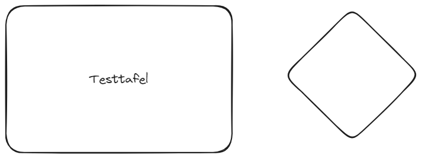

<!--
author:   Your Name

email:    your@mail.org

version:  0.0.1

language: en

narrator: US English Female

comment:  Try to write a short comment about
          your course, multiline is also okay.

link:     https://cdn.jsdelivr.net/chartist.js/latest/chartist.min.css

script:   https://cdn.jsdelivr.net/chartist.js/latest/chartist.min.js

import: https://raw.githubusercontent.com/liaScript/mermaid_template/master/README.md

import: https://raw.githubusercontent.com/LiaTemplates/CollaborativeDrawing/main/README.md

persistent: true

-->

# Course Main Titel

This is your **course** initialization stub.

Please see the [Docs](https://liascript.github.io/course/?https://raw.githubusercontent.com/liaScript/docs/master/README.md)
to find out what is possible in [LiaScript](https://liascript.github.io).

If you want to use instant help in your Atom IDE, please type **lia** to see all available shortcuts.

## Markdown

You can use common [Markdown](https://github.com/adam-p/markdown-here/wiki/Markdown-Cheatsheet) syntax to create your course, such as:

1. Lists
2. ordered or

   * unordered
   * ones ...


| Header 1   | Header 2   |
| :--------- | :--------- |
| Item 1     | Item 2     |


Images:


### Extensions

     --{{0}}--
But you can also include other features such as spoken text.

      --{{1}}--
Insert any kind of audio file:

       {{1}}
?[audio](https://bigsoundbank.com/UPLOAD/mp3/1068.mp3)


     --{{2}}--
Even videos or change the language completely.

       {{2-3}}
!?[video](https://www.youtube.com/watch?v=bICfKRyKTwE)


      --{{3 Russian Female}}--
Первоначально создан в 2004 году Джоном Грубером (англ. John Gruber) и Аароном
Шварцем. Многие идеи языка были позаимствованы из существующих соглашений по
разметке текста в электронных письмах...


    {{3}}
Type "voice" to see a list of all available languages.


### Styling

<!-- class = "animated rollIn" style = "animation-delay: 2s; color: purple" -->
The whole text-block should appear in purple color and with a wobbling effect.
Which is a **bad** example, please use it with caution ...
~~ only this is red ;-) ~~ <!-- class = "animated infinite bounce" style = "color: red;" -->

## Charts

Use ASCII-Art to draw diagrams:

                                    Multiline
    1.9 |    DOTS
        |                 ***
      y |               *     *
      - | r r r r r r r*r r r r*r r r r r r r
      a |             *         *
      x |            *           *
      i | B B B B B * B B B B B B * B B B B B
      s |         *                 *
        | *  * *                       * *  *
     -1 +------------------------------------
        0              x-axis               1

## Quizzes

### A Textquiz

What did the **fish** say when he hit a **concrete wall**?

    [[dam]]

### Multiple Choice

Just add as many points as you wish:

    [[X]] Only the **X** marks the correct point.
    [[ ]] Empty ones are wrong.
    [[X]] ...

### Single Choice

Just add as many points as you wish:

    [( )] ...
    [(X)] <-- Only the **X** is allowed.
    [( )] ...

## Executable Code

A drawing example, for demonstrating that any JavaScript library can be used, also for drawing.

```javascript
// Initialize a Line chart in the container with the ID chart1
new Chartist.Line('#chart1', {
  labels: [1, 2, 3, 4],
  series: [[100, 120, 180, 200]]
});

// Initialize a Line chart in the container with the ID chart2
new Chartist.Bar('#chart2', {
  labels: [1, 2, 3, 4],
  series: [[5, 2, 8, 3]]
});
```
<script>@input</script>

<div class="ct-chart ct-golden-section" id="chart1"></div>
<div class="ct-chart ct-golden-section" id="chart2"></div>


### Projects

You can make your code executable and define projects:

``` js     -EvalScript.js
let who = data.first_name + " " + data.last_name;

if(data.online) {
  who + " is online"; }
else {
  who + " is NOT online"; }
```
``` json    +Data.json
{
  "first_name" :  "Sammy",
  "last_name"  :  "Shark",
  "online"     :  true
}
```
<script>
  // insert the JSON dataset into the local variable data
  let data = @input(1);

  // eval the script that uses this dataset
  eval(`@input(0)`);
</script>

## Arbeitsblätter

[Arbeitsblatt Onedrive](https://bsomichelstadtde-my.sharepoint.com/:b:/g/personal/jan_mueller_bso-michelstadt_de/EbhvLBPghXBFi7YxYfdnIt0B3Jlpj1q98NT5s03QBnkeRg?e=DCcuDH)

[Arbeitsblatt Github](https://github.com/JMueller-edu/LiaScriptKurse/blob/ea3700db3fce55afac3e2b70232f4916042364a5/assets/24.pdf)

[Arbeitsblatt Relativ](assets/24.pdf)

<style>.embed-container { position: relative; padding-bottom: 56.25%; height: 0; overflow: hidden; max-width: 100%; } .embed-container iframe, .embed-container object, .embed-container embed { position: absolute; top: 0; left: 0; width: 100%; height: 100%; }</style><div class='embed-container'><iframe src='assets/24.pdf' style='border:0'></iframe></div>

[Arbeitsblatt Adobe](https://acrobat.adobe.com/id/urn:aaid:sc:EU:1d258f0e-fee7-411e-a481-8a071cc10715)


## More

Find out what you can even do more with quizzes:

https://liascript.github.io/course/?https://raw.githubusercontent.com/liaScript/docs/master/README.md

## Quizzes

    {{1-2}}
*******************************************************************

Zu welcher Hypervisor-Kategorie gehört der Microsoft Virtual PC?

[[ ]] Typ 1
[[ ]] Typ 2
[[ ]] Typ 3
[[ ]] Typ 4

********************************************************************

    {{2}}
**********************************************************************

Welche Aussage beschreibt ein Merkmal von Cloud Computing?

[[ ]] Ein Unternehmen kann sich direkt mit dem Internet verbinden, ohne einen ISP zu verwenden.
[[ ]] Auf Anwendungen kann über das Internet über ein Abonnement zugegriffen werden.
[[ ]] Geräte können über vorhandene elektrische Leitungen mit dem Internet verbunden werden.
[[ ]] Investitionen in eine neue Infrastruktur sind erforderlich, um auf die Cloud zugreifen zu können.

*************************************************************************
## Animation

     {{1}}
This is an example for a *single* block animations.

     {{2-3}}
This one will appear on animation step 2 and disappear on 3.

{{4}} This is also ok, but it will look be harder to spot on GitHub.

## Mermaid

```@mermaid
gantt
    dateFormat  YYYY-MM-DD
    title       Adding GANTT diagram functionality to mermaid
    excludes    weekends

    section A section
    Completed task            :done,    des1, 2014-01-06,2014-01-08
    Active task               :active,  des2, 2014-01-09, 3d
    Future task               :         des3, after des2, 5d
    Future task2              :         des4, after des3, 5d

    section Critical tasks
    Completed task in the critical line :crit, done, 2014-01-06,24h
    Implement parser and jison          :crit, done, after des1, 2d
    Create tests for parser             :crit, active, 3d
    Future task in critical line        :crit, 5d
    Create tests for renderer           :2d
    Add to mermaid                      :until isadded
    Functionality added                 :milestone, isadded, 2014-01-25, 0d

    section Documentation
    Describe gantt syntax               :active, a1, after des1, 3d
    Add gantt diagram to demo page      :after a1  , 20h
    Add another diagram to demo page    :doc1, after a1  , 48h

    section Last section
    Describe gantt syntax               :after doc1, 3d
    Add gantt diagram to demo page      :20h
    Add another diagram to demo page    :48h
```

## Tafelbild



## ASCII-Art 

``` ascii 

                +-----------------------------------------+            
                | Wöchentliches sichten der Anwesenheiten |            
                | in der Klassenmappe in Mein Unterricht  |            
                +--------------------+--------------------+            
                                     |                                 
                           nach fünf |Fehltagen                        
                                     |                                 
            +------------------------v---------------------------+     
            | Automatischer Hinweis in der Anwesenheitsübersicht |     
            | der Klassenmappe in Mein Unterricht                |     
            +------------------------+---------------------------+     
                                     |                                 
                                     |                                 
                                     |                                 
                     +---------------v-----------------+               
                     | Sind die Fehltage entschuldigt? |               
                     +---------------+-----------------+               
                                     |                                 
                                    nein                               
                                     |                                 
              +----------------------v--------------------------+      
              | Entschuldigung bei den Erziehungsberechtigten   |      
              | mit Abgabefrist von drei Schultagen einfordern! |      
              +----------------------+--------------------------+      
                                     |                                 
                                     |                                 
                                     |                                 
                   +-----------------v----------------------+          
                   | Wird eine Entschuldigung nachgereicht? |          
                   +----------------------------------------+          
                   |                                        |          
                  nein                                     ja          
                   |                                        |          
+------------------v----------------+ +---------------------v---------+
| schriftliche Mahnung an die       | | Entschuldigung im Schulportal |
| Erziehungsberechtigten versenden! | | eintragen!                    |
+------------------+----------------+ +-------------------------------+
                   |                                                   
                   |                                                   
                   |                                                   
     +-------------v----------+                                        
     | Elterngespräch führen! +------+                                 
     +------------------------+      |                                 
                                     |                                 
                                     |                                 
                                     |                                 
                 +-------------------v----------------+                
                 | Tritt eine Verhaltensänderung ein? |                
                 +-------------------+----------------+                
                                     |                                 
                                    nein                               
                                     |                                 
            +------------------------v--------------------+            
            |  Stellen eines Antrags auf Einleitung eines |            
            |  Ordnungswidrigkeitsverfahrens!             |            
            +---------------------------------------------+            
                             
```
## Whiteboards


<style>.embed-container { position: relative; padding-bottom: 56.25%; height: 0; overflow: hidden; max-width: 100%; } .embed-container iframe, .embed-container object, .embed-container embed { position: absolute; top: 0; left: 0; width: 100%; height: 100%; }</style><div class='embed-container'><iframe src='https://acrobat.adobe.com/id/urn:aaid:sc:EU:1d258f0e-fee7-411e-a481-8a071cc10715' style='border:0'></iframe></div>

<style>.embed-container { position: relative; height: 0; overflow: hidden; max-width: 100%; } .embed-container iframe, .embed-container object, .embed-container embed { position: absolute; top: 0; left: 0; width: 100%; height: 100%; }</style><div class='embed-container'><iframe src='https://www.tldraw.com/r/UhzZ3O1WEVwy6iYKLdlMn?v=0,-100,1385,885&p=page' style='border:0'></iframe></div>

<div class="container">
  <iframe class="responsive-iframe"; style="width: 100%; src="https://www.tldraw.com/ro/6Uoz8hwn8iu031yeYY9ZC?v=0,-100,1385,885&p=page"></iframe>
</div>

@Collaborative.lines(640,320,https://upload.wikimedia.org/wikipedia/commons/thumb/7/7e/Pieter_Brueghel_the_Elder_-_The_Dutch_Proverbs_-_Google_Art_Project.jpg/1280px-Pieter_Brueghel_the_Elder_-_The_Dutch_Proverbs_-_Google_Art_Project.jpg)

@[Collaborative.lines(640,320)](assets/tafelbild.excalidraw.png)