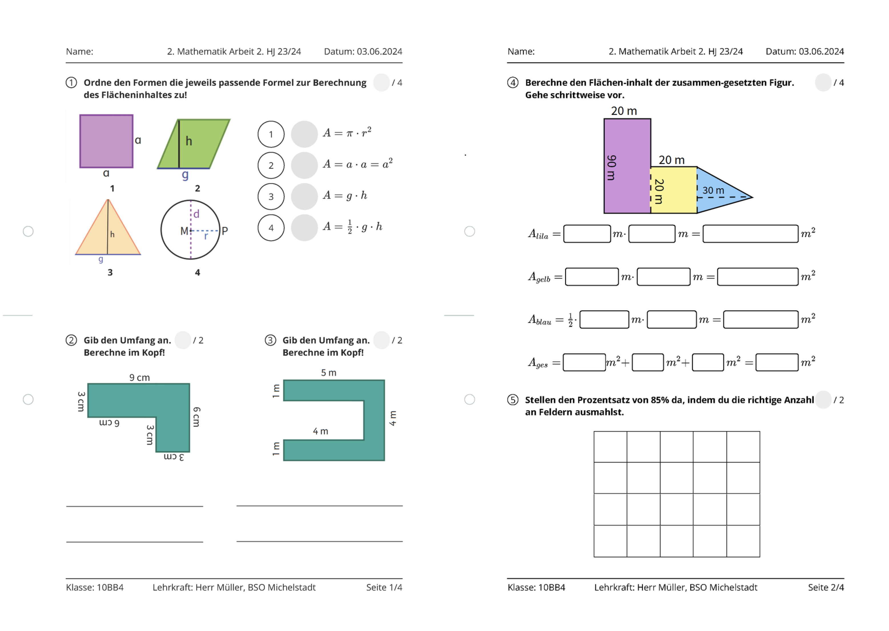

<!--
author:   Your Name

email:    your@mail.org

version:  0.0.1

language: en

narrator: US English Female

comment:  Try to write a short comment about
          your course, multiline is also okay.

link:     https://cdn.jsdelivr.net/chartist.js/latest/chartist.min.css

script:   https://cdn.jsdelivr.net/chartist.js/latest/chartist.min.js

import: https://raw.githubusercontent.com/liaScript/mermaid_template/master/README.md

-->

# Course Main Titel

This is your **course** initialization stub.

Please see the [Docs](https://liascript.github.io/course/?https://raw.githubusercontent.com/liaScript/docs/master/README.md)
to find out what is possible in [LiaScript](https://liascript.github.io).

If you want to use instant help in your Atom IDE, please type **lia** to see all available shortcuts.

## Markdown

You can use common [Markdown](https://github.com/adam-p/markdown-here/wiki/Markdown-Cheatsheet) syntax to create your course, such as:

1. Lists
2. ordered or

   * unordered
   * ones ...


| Header 1   | Header 2   |
| :--------- | :--------- |
| Item 1     | Item 2     |


Images:


### Extensions

     --{{0}}--
But you can also include other features such as spoken text.

      --{{1}}--
Insert any kind of audio file:

       {{1}}
?[audio](https://bigsoundbank.com/UPLOAD/mp3/1068.mp3)


     --{{2}}--
Even videos or change the language completely.

       {{2-3}}
!?[video](https://www.youtube.com/watch?v=bICfKRyKTwE)


      --{{3 Russian Female}}--
Первоначально создан в 2004 году Джоном Грубером (англ. John Gruber) и Аароном
Шварцем. Многие идеи языка были позаимствованы из существующих соглашений по
разметке текста в электронных письмах...


    {{3}}
Type "voice" to see a list of all available languages.


### Styling

<!-- class = "animated rollIn" style = "animation-delay: 2s; color: purple" -->
The whole text-block should appear in purple color and with a wobbling effect.
Which is a **bad** example, please use it with caution ...
~~ only this is red ;-) ~~ <!-- class = "animated infinite bounce" style = "color: red;" -->

## Charts

Use ASCII-Art to draw diagrams:

                                    Multiline
    1.9 |    DOTS
        |                 ***
      y |               *     *
      - | r r r r r r r*r r r r*r r r r r r r
      a |             *         *
      x |            *           *
      i | B B B B B * B B B B B B * B B B B B
      s |         *                 *
        | *  * *                       * *  *
     -1 +------------------------------------
        0              x-axis               1

## Quizzes

### A Textquiz

What did the **fish** say when he hit a **concrete wall**?

    [[dam]]

### Multiple Choice

Just add as many points as you wish:

    [[X]] Only the **X** marks the correct point.
    [[ ]] Empty ones are wrong.
    [[X]] ...

### Single Choice

Just add as many points as you wish:

    [( )] ...
    [(X)] <-- Only the **X** is allowed.
    [( )] ...

## Executable Code

A drawing example, for demonstrating that any JavaScript library can be used, also for drawing.

```javascript
// Initialize a Line chart in the container with the ID chart1
new Chartist.Line('#chart1', {
  labels: [1, 2, 3, 4],
  series: [[100, 120, 180, 200]]
});

// Initialize a Line chart in the container with the ID chart2
new Chartist.Bar('#chart2', {
  labels: [1, 2, 3, 4],
  series: [[5, 2, 8, 3]]
});
```
<script>@input</script>

<div class="ct-chart ct-golden-section" id="chart1"></div>
<div class="ct-chart ct-golden-section" id="chart2"></div>


### Projects

You can make your code executable and define projects:

``` js     -EvalScript.js
let who = data.first_name + " " + data.last_name;

if(data.online) {
  who + " is online"; }
else {
  who + " is NOT online"; }
```
``` json    +Data.json
{
  "first_name" :  "Sammy",
  "last_name"  :  "Shark",
  "online"     :  true
}
```
<script>
  // insert the JSON dataset into the local variable data
  let data = @input(1);

  // eval the script that uses this dataset
  eval(`@input(0)`);
</script>

## Drawings


## Arbeitsblätter

[Arbeitsblatt Onedrive](https://bsomichelstadtde-my.sharepoint.com/:b:/g/personal/jan_mueller_bso-michelstadt_de/EbhvLBPghXBFi7YxYfdnIt0B3Jlpj1q98NT5s03QBnkeRg?e=DCcuDH)

[Arbeitsblatt Github](https://acrobat.adobe.com/id/urn:aaid:sc:EU:1d258f0e-fee7-411e-a481-8a071cc10715)


## More

Find out what you can even do more with quizzes:

https://liascript.github.io/course/?https://raw.githubusercontent.com/liaScript/docs/master/README.md

## Quizzes

    {{1-2}}
*******************************************************************

Zu welcher Hypervisor-Kategorie gehört der Microsoft Virtual PC?

[[ ]] Typ 1
[[ ]] Typ 2
[[ ]] Typ 3
[[ ]] Typ 4

********************************************************************

    {{2}}
**********************************************************************

Welche Aussage beschreibt ein Merkmal von Cloud Computing?

[[ ]] Ein Unternehmen kann sich direkt mit dem Internet verbinden, ohne einen ISP zu verwenden.
[[ ]] Auf Anwendungen kann über das Internet über ein Abonnement zugegriffen werden.
[[ ]] Geräte können über vorhandene elektrische Leitungen mit dem Internet verbunden werden.
[[ ]] Investitionen in eine neue Infrastruktur sind erforderlich, um auf die Cloud zugreifen zu können.

*************************************************************************
## Animation

     {{1}}
This is an example for a *single* block animations.

     {{2-3}}
This one will appear on animation step 2 and disappear on 3.

{{4}} This is also ok, but it will look be harder to spot on GitHub.

## Mermaid

```@mermaid
graph TD
A[Start] --> B{Teilnahme an berufsorientierter Projektprüfung?}
B --> C{Alle Fächer und Lernbereiche mindestens ausreichend?} | Nein: F[Abschluss nicht möglich]
C --> D{Nicht ausreichende Leistungen?} | Nein: E[Abschluss möglich]
D --> G{Ausgleich möglich?} | Nein: H[Abschluss nicht möglich]
G --> I{Ausgleichsbedingungen erfüllt?} | Nein: H[Abschluss nicht möglich]
I --> J[Abschluss möglich] | Nein: H[Abschluss nicht möglich]

```

```@mermaid
gantt
    dateFormat YYYY-MM-DD
    section Fitness (E.3)
        KW5     :2024-01-29, 1d
        KW6     :2024-02-05, 1d

    section Badminton
        KW8     :2024-02-19, 1d
        KW9     :2024-02-26, 1d
        KW10    :2024-03-04, 1d
        KW11    :2024-03-11, 1d
        KW12    :2024-03-18, 1d

    section Schwimmen (E.1)
        KW16    :2024-04-15, 1d
        KW17    :2024-04-22, 1d
        KW18    :2024-04-29, 1d
        KW19    :2024-05-06, 1d
        KW20    :2024-05-13, 1d
        KW22    :2024-05-27, 1d
    
    section ?? E.??
        KW23    :2024-06-03, 1d
        KW24    :2024-06-10, 1d
        KW25    :2024-06-17, 1d
        KW26    :2024-06-24, 1d
        KW27    :2024-07-01, 1d
        KW28    :2024-07-08, 1d
  
```
## Tafelbild


