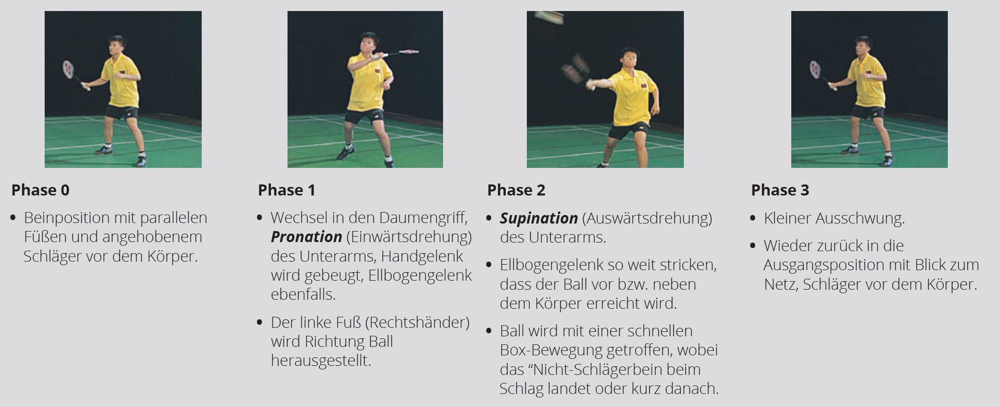
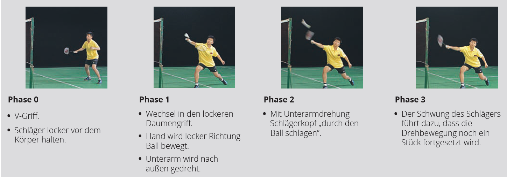
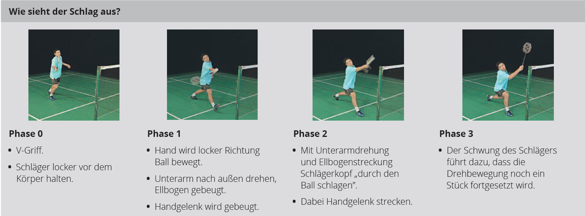
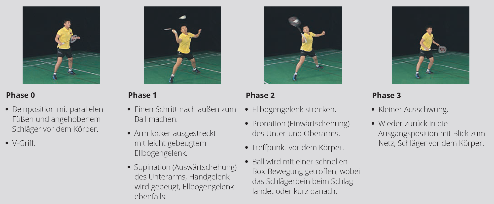

<!--
author: Jan Müller

titel: Sport BG E12.1 Schuljahr 23/24

icon: assets/BSO_LOGO_1.png

email:  SmFuLk11ZWxsZXI0QHNjaHVsZS5oZXNzZW4uZGU= (base64;-)

version:  0.1.0

language: Deutsch

narrator: Deutsch Female

comment:  Bei der Erstellung dieser Arbeitsmaterialien wurde teilweise Bing-Chat verwendet. Als Initial-Prompts wurden meist die im Text befindlichen Überschriften in Frageform verwendet. 

link:     https://cdn.jsdelivr.net/chartist.js/latest/chartist.min.css

script:   https://cdn.jsdelivr.net/chartist.js/latest/chartist.min.js

import: https://raw.githubusercontent.com/liaScript/mermaid_template/master/README.md

-->


# Sport BG E12.1 Schuljahr 23/24 1. Halbjahr


## Basketball - Taktik


Die Taktik spielt im modernen Basketball eine wichtige Rolle. Sie kann über Sieg und Niederlage entschieden. 

Die Taktik gliedert sich in folgende drei aufeinander aufbauenden Bereiche[^1]:

1. Individualtaktik in Angriff und Verteidigung
2. Gruppentaktik in Angriff und Verteidigung
3. Mannschaftstaktiken in Angriff und Verteidigung

[^1]: Das Spiel mit dem Roten Ball - Adolph&Becker - Kapitel 5

### Individualtaktiken im Basketball


Individualtaktiken im Basketball sind die gezielten Maßnahmen, die ein Spieler anwendet, um einen Vorteil oder einen Nachteil gegenüber seinem Gegner zu erlangen. Es gibt verschiedene Arten von Individualtaktiken, die je nach Situation und Position des Spielers angewendet werden können. 
In diesem Artikel werden einige Beispiele für Individualtaktiken im Angriff und in der Verteidigung vorgestellt.

#### Individualtaktiken im Angriff


Individualtaktiken im Basketball im Angriff sind die gezielten Maßnahmen, die ein Spieler anwendet, um einen Vorteil gegenüber seinem Gegner zu erlangen und einen erfolgreichen Abschluss zu erzielen. 

Es gibt verschiedene Arten von Individualtaktiken, die je nach Situation und Position des Spielers angewendet werden können. Einige Beispiele sind:

- **Schrittfinten:** Das sind Täuschungsschritte, die der Angreifer ausführt, um den Verteidiger zu verwirren und an ihm vorbeizuziehen. Es gibt verschiedene Arten von Schrittfinten, wie z.B. Jab Step, Jab & Go, Cross-Over-Step, Rocker Step und Rocker & Go[^1].
- **Dribbelfinten:** Das sind Handwechsel oder Geschwindigkeitsänderungen, die der Angreifer während des Dribbelns macht, um den Verteidiger auszuspielen oder abzuschütteln. Es gibt verschiedene Arten von Dribbelfinten, wie z.B. Hesitation, Crossover, Behind-the-Back, Between-the-Legs und Spin Move[^1].
- **Lauffinten:** Diese werden vom Angreifer ohne Ball ausgeführt. Sie dienen vor allem dazu sich vom direkten Gegenspieler abzusetzen und in Ballbesitz zu kommen[^1]. Beispiele sind der I-Cut, V-Cut und L-Cut.
- **Passfinten:** Unter Passfinden versteht man das Antäuschen eines Passes in einen bestimmte Richtung und das Spielen des Pases in einen andere Richtung. Ein sehr bekanntes Beispiel ist der no-look-pass[^2].
- **Wurffinten:** Eine Wurffinte wird angewendet, um den Verteidiger aus seiner stabilen Position herauszubringen. Z.b. durch einen Blick zum Korb und das Über-den-Kopf-nehmen des Balles wird eine Korpwurf fintiert. Reagiert der Verteidiger daruf wird er sich strecken oder sogar springen, sodass der Verteidiger evtl. an ihm Vorbeidribbeln kann[^2].

[^1]: 1-1 Angreiferschulung - 3 - Basketball Co\@ches Corner https://www.bbcoach.de/wp/1-1-angreiferschulung-3/.
[^2]: Das Spiel mit dem Roten Ball - Adolph&Becker - Kapitel 5.1.1.3

---
**Weitere Quellen**

- [Individuelles Angriffspiel - DHB Trainer Center.](https://www.dhb-trainercenter.de/dhb-rahmentrainingskonzeption/grundlagentraining/individuelles-angriffspiel/?L=0.)
- [Basketball-Taktik: Gezielte Strategien zu Angriff & Verteidigung.](https://www.owayo.de/magazin/basketballtaktik-gezielte-strategien-angriff-und-verteidigung-basketball-de.htm.)
- [Der Angriff im Basketball - VIBSS.](https://vibss.de/fileadmin/Medienablage/Sportpraxis/PH_Basketball/PH_Basketball_-_Angriff.pdf.)

#### Individuelle Grundstellung im Angriff


Die Basketballgrundstellung Tuck-Stellung, das Facing und die SPD-Position sind wichtige Elemente der Individualtaktik im Angriff. Sie ermöglichen es dem Spieler, flexibel und schnell auf die Spielsituation zu reagieren und eine der drei Optionen Schießen, Passen oder Dribbeln auszuführen. Die Begriffe bedeuten:

- **Tuck-Stellung**: Die Tuck-Stellung ist eine Körperhaltung, bei der der Spieler den Ball mit beiden Händen fest umfasst und ihn etwas seitlich am Körper auf Hüfthöhe hält. Damit schützt er den Ball vor dem Verteidiger und ist bereit, ihn zu passen oder zu dribbeln[^1].
- **Facing**: Das Facing ist die Ausrichtung des Spielers zum Korb. Der Spieler sollte immer mit dem Gesicht zum Korb stehen, um die Wurfmöglichkeiten zu erkennen und den Blickkontakt mit den Mitspielern zu halten[^2].
- **SPD-Position**: Die SPD-Position (Schießen, Passen, Dribbeln) ist die Grundstellung eines Spielers in Ballbesitz. Sie wird auch als Triple-Threat-Position oder Dreifach-Bedrohung bezeichnet, da der Spieler drei Optionen hat, die er ausführen kann. Die SPD-Position ist durch die folgende Körperhaltung gekennzeichnet[^3]:
  
  - parallele Fußstellung
  - Gewicht auf den Fußballen
  - Gleichgewicht
  - gebeugte Knie
  - aufrechter Oberkörper
  - Kopf hoch, Blick zum Korb
  - Ball mit beiden Händen fest umpackt
  - Geschütze Ballhaltung auf Hüfthöhe


Die SPD-Position ist die Basketballgrundstellung, die aus dem Ein-Kontakt-Stopp oder dem Tuck-Stopp erreicht werden kann. Sie ermöglicht es dem Spieler, explosiv anzutreten, einen Schuss zu nehmen oder einen Pass zu spielen[^3].

[^1]: Einführung der SPD-Position – Basketball Co\@ches Corner. https://www.bbcoach.de/wp/einfuhrung-der-spd-position/.
[^2]: Fangen und Passen, Spielformen – Basketball Co\@ches Corner. https://www.bbcoach.de/wp/fangen-und-passen-spielformen/.
[^3]: SPD-Stellung – Wikipedia. https://de.wikipedia.org/wiki/SPD-Stellung.

### Individualtaktiken in der Verteidigung


Individualtaktiken im Basketball in der Verteidigung sind die gezielten Maßnahmen, die ein Spieler anwendet, um einen Nachteil gegenüber seinem Gegner zu vermeiden und einen erfolgreichen Ballgewinn zu erzielen. 

Es gibt verschiedene Arten von Individualtaktiken, die je nach Situation und Position des Spielers angewendet werden können. Einige Beispiele sind:

- **Beinarbeit:** Das ist die Fähigkeit, sich schnell und geschickt mit den Füßen zu bewegen, um den Angreifer zu verfolgen, abzudrängen oder zu blocken. Es gibt verschiedene Arten von Beinarbeit, wie z.B. Push Step, Swing Step, Release Step und Slide Step[^1].
- **Armarbeit:** Das ist die Fähigkeit, die Arme aktiv und gezielt einzusetzen, um den Angreifer zu stören, zu behindern oder den Ball abzunehmen. Es gibt verschiedene Arten von Armarbeit, wie z.B. Hand in the Face, Hand Check, Hand Denial und Hand Steal[^1].
- **Körperhaltung:** Das ist die Fähigkeit, eine optimale Position und Balance zu halten, um den Angreifer zu kontrollieren und zu reagieren. Eine gute Körperhaltung beinhaltet eine leichte Vorlage des Oberkörpers, eine tiefe Hüftstellung, eine breite Beinstellung und einen Blick auf den Ball[^1].
- **Antizipation:** Das ist die Fähigkeit, die Absichten und Bewegungen des Angreifers vorherzusehen und entsprechend zu handeln. Eine gute Antizipation erfordert eine hohe Konzentration, eine gute Beobachtung und eine schnelle Entscheidung[^2].

[^1]: Basketball-Taktik: Gezielte Strategien zu Angriff & Verteidigung. https://www.owayo.de/magazin/basketballtaktik-gezielte-strategien-angriff-und-verteidigung-basketball-de.htm.
[^2]: Basketball in der Schule: Die Verteidigung » mobilesport.ch. https://www.mobilesport.ch/basketball/basketball-in-der-schule-die-verteidigung/.

---
**Weitere Quellen**

- [1-1 Angreiferschulung – 3 – Basketball Co\@ches Corner.](https://www.bbcoach.de/wp/1-1-angreiferschulung-3/.)
- [Basketballtraining.de » Die Individual-Verteidigung als Grundlage jeder ....](http://basketballtraining.de/die-individual-verteidigung-als-grundlage-jeder-verteidigungsstrategie/.)
- [Basketballtraining.de » Individual- und Gruppentaktik im Basketball ....](http://basketballtraining.de/78/.)

#### Individuelle Grundstellung in der Verteidigung


Die Körperstellung in der Verteidigung im Basketball ist eine wichtige Grundlage, um den Angriff des Gegners zu stoppen oder den Ball zu erobern. Dabei geht es darum, die eigene Balance, Beweglichkeit und Reaktionsfähigkeit zu optimieren und den Gegner unter Druck zu setzen. 

Eine gute Körperstellung in der Verteidigung im Basketball ist durch die folgenden Merkmale gekennzeichnet[^1][^2]:

- Die Füße stehen parallel und schulterbreit auseinander. Damit hat der Spieler eine stabile Basis und kann schnell in alle Richtungen laufen oder springen.
- Die Knie sind leicht gebeugt und das Gewicht ist auf den Fußballen verteilt. Damit kann der Spieler explosiv starten, stoppen oder wechseln und seine Geschwindigkeit anpassen.
- Der Oberkörper ist aufrecht und der Kopf ist hoch. Damit hat der Spieler eine gute Sicht auf den Ball, den Gegenspieler und das Spielfeld und kann die Situation lesen und antizipieren.
- Die Arme sind seitlich vorne mit leicht gebeugten Ellbogen angehoben und die Handflächen zeigen nach oben. Damit kann der Spieler den Gegenspieler stören, Pässe abfangen oder Würfe blockieren.
- Die Verteidigungsposition sollte immer so sein, dass der Spieler sich zwischen dem Gegenspieler und dem Korb befindet. Damit kann er den Zugang zum Korb erschweren und den Winkel für einen Wurf verkleinern.
  
Die Körperstellung in der Verteidigung im Basketball sollte immer an die Spielsituation angepasst werden. Zum Beispiel sollte der Spieler seinen Abstand zum Gegenspieler je nach dessen Stärken und Schwächen variieren. Wenn der Gegenspieler ein guter Distanzschütze ist, sollte der Spieler näher an ihm dran sein, um den Wurf zu erschweren. Wenn der Gegenspieler ein guter Penetrator ist, sollte der Spieler etwas mehr Abstand halten, um den Zug zum Korb zu verhindern[^2].

[^1]: Die Verteidigung im Basketball - VIBSS. https://vibss.de/fileadmin/Medienablage/Sportpraxis/PH_Basketball/PH_Basketball_-_Verteidigung.pdf.
[^2]: Unterrichtseinheit 14: Verteidigung MMV (Mann-Mann-Verteidigung) - DBB. https://www.basketball-bund.de/wp-content/uploads/UE-14-Verteidigung-MMV-Mann-Mann-Verteidigung.pdf.

### Gruppentaktik im Angriff


Gruppentaktiken im Angriff beim Basketball sind die gezielten Strategien, die eine kleine Gruppe von Spielern anwendet, um sich einen Vorteil gegenüber der gegnerischen Verteidigung zu verschaffen. Dabei geht es darum, die eigenen technischen und körperlichen Fähigkeiten optimal zu nutzen und die Schwächen der Gegner auszunutzen. 

Einige mögliche Gruppentaktiken im Angriff beim Basketball sind:

- **Pick and Roll**: Ein Pick and Roll ist eine Gruppentaktik, die durch zwei Spieler ausgeführt wird. Dabei stellt ein Spieler (der Picker) seinem Mitspieler (dem Ballführer) einen Block, um ihn vom Verteidiger freizubekommen. Anschließend löst sich der Picker vom Block und läuft zum Korb (Roll). Der Ballführer kann dann entweder selbst werfen oder den Picker anspielen¹. Der Pick and Roll erfordert eine gute Abstimmung zwischen den beiden Spielern und eine schnelle Entscheidung des Ballführers[^1].
- **Give and Go**: Ein Give and Go ist eine weitere Gruppentaktik, die durch zwei Spieler ausgeführt wird. Dabei passt ein Spieler den Ball zu einem Mitspieler und läuft sich dann selbst frei (Give). Der Mitspieler passt den Ball zurück zum ursprünglichen Ballführer, der nun in einer guten Wurfposition ist (Go). Das Give and Go setzt voraus, dass der Spieler sich vom Gegner lösen und sich anbieten kann[^2].

[^1]: Basketball-Taktik: Gezielte Strategien zu Angriff & Verteidigung. https://www.owayo.de/magazin/basketballtaktik-gezielte-strategien-angriff-und-verteidigung-basketball-de.htm.
[^2]: Der Angriff im Basketball - VIBSS. https://vibss.de/fileadmin/Medienablage/Sportpraxis/PH_Basketball/PH_Basketball_-_Angriff.pdf.

---
**Weitere Quellen**

- [Gruppentaktik – eine zentrale Taktik im Basketball.](ttps://basketballtraining.de/gruppentaktik-eine-zentrale-taktik-im-basketball/.)

### Gruppentaktik in der Verteidigung


Gruppentaktiken in der Verteidigung im Basketball sind die gezielten Strategien, die eine kleine Gruppe von Spielern anwendet, um den Angriff des Gegners zu stoppen oder den Ball zu erobern. Dabei geht es darum, die eigenen technischen und körperlichen Fähigkeiten optimal zu nutzen und die Stärken des Gegners zu neutralisieren. 

Einige mögliche Gruppentaktiken in der Verteidigung im Basketball sind:

- **Zonenverteidigung**: Eine Zonenverteidigung ist eine Gruppentaktik, bei der die Spieler nicht einen bestimmten Gegenspieler, sondern einen bestimmten Raum auf dem Spielfeld verteidigen. Dabei teilen sich die Spieler das Spielfeld in verschiedene Zonen auf, die sie je nach Position und Situation übernehmen. Ziel einer Zonenverteidigung ist es, den Zugang zum Korb zu erschweren, Pässe abzufangen oder Würfe zu blockieren[^1].
- **Mann-gegen-Mann-Verteidigung**: Eine Mann-gegen-Mann-Verteidigung ist eine Gruppentaktik, bei der jeder Spieler einen bestimmten Gegenspieler direkt verteidigt. Dabei versucht der Verteidiger, den Angreifer am Ballbesitz, am Dribbling, am Passen oder am Werfen zu hindern. Ziel einer Mann-gegen-Mann-Verteidigung ist es, den Gegner unter Druck zu setzen, Fehler zu provozieren oder den Ball zu erobern[^1].
- **Mischformen**: Neben den reinen Varianten der Zonenverteidigung und der Mann-gegen-Mann-Verteidigung gibt es auch Mischformen, bei denen die Mehrheit der verteidigenden Spieler den Raum und einer oder zwei Spieler einen direkten Gegenspieler verteidigen. Die bekanntesten Mischformen sind die Box-and-One-, die Triangle-and-Two- und die Diamond-and-One-Verteidigung. Ziel einer Mischform ist es, die gefährlichsten Angreifer des Gegners auszuschalten oder die gegnerische Angriffsstrategie zu stören[^2].

[^1]: Gruppentaktik – eine zentrale Taktik im Basketball. https://basketballtraining.de/gruppentaktik-eine-zentrale-taktik-im-basketball/.
[^2]: Basketball-Taktik: Gezielte Strategien zu Angriff & Verteidigung. https://www.owayo.de/magazin/basketballtaktik-gezielte-strategien-angriff-und-verteidigung-basketball-de.htm.

---
**Weiterer Quellen**

- [Basketball: Mischformen aus Zonenverteidigung und Mann-gegen-Mann ....](https://www.trainingsworld.com/training/taktiktraining/basketball-taktik-mischformen-zonenverteidigung-mann-gegen-mann-verteidigung-2503373.)
- [Basketball in der Schule: Die Verteidigung » mobilesport.ch.](https://www.mobilesport.ch/basketball/basketball-in-der-schule-die-verteidigung/.)
- [Basketball Übungen für verteidigen Verwendung in Ihrem Training?.](https://www.yoursportplanner.com/de/ubungen/basketball-de/verteidigen/.)

### Lernkarten


**Hier geht es zu den [Lernkarten](https://app.mochi.cards/decks/67233147-73f4-462a-984f-207550c6f793/HRqVAMT4/Basketball-Taktik)**.


Zum Lernen der Karten wählen Sie auf der Webseite oben rechts unter New cards den Menüpunkt `Cram` aus.


Um eine Karteikarte umzublättern klicken Sie diese einfach an.

Mit Hilfe der Rückseite überprüfen Sie, ob Sie die Antwort gewusst oder nicht gewusst haben.

- Mit der `Space` Taste zeigen Sie an, dass Sie die Antwort wussten.
- Mit der `R` Taste zeigen Sie an, dass Sie diese noch nicht wussten.

### Kompetenzcheck

**1. Ordnen Sie die folgenden Beschreibung der jeweils passenden Fintenart zu!**

<!-- 
    data-randomize 
    data-solution-button="off"
    data-max-trials="3" 
-->
| Fintenart | Beschreibung                  |
| ------------- | ------------------------ |
| [[ Lauffinten | Wurffinten | Passfinten | Dribblefinten | (Schrittfinten) ]] | Das sind Täuschungsschritte, die der Angreifer ausführt, um den Verteidiger zu verwirren und an ihm vorbeizuziehen. |
| [[ Lauffinten | Wurffinten | Passfinten | (Dribblefinten) | Schrittfinten ]] |  Das sind Handwechsel oder Geschwindigkeitsänderungen, die der Angreifer während des Dribbelns macht, um den Verteidiger auszuspielen oder abzuschütteln. |
| [[ (Lauffinten) | Wurffinten | Passfinten | Dribblefinten | Schrittfinten ]] | Diese werden vom Angreifer ohne Ball ausgeführt. Sie dienen vor allem dazu sich vom direkten Gegenspieler abzusetzen und in Ballbesitz zu kommen |
| [[ Lauffinten | Wurffinten | (Passfinten) | Dribblefinten | Schrittfinten ]] | Unter diesen Finten versteht man das Antäuschen eines Passes in einen bestimmte Richtung und das Spielen des Pases in einen andere Richtung. |
| [[ Lauffinten |(Wurffinten) | Passfinten | Dribblefinten | Schrittfinten ]] | Diese Finte wird angewendet, um den Verteidiger aus seiner stabilen Position herauszubringen. Z.b. durch einen Blick zum Korb und das Über-den-Kopf-nehmen des Balles wird eine Korpwurf fintiert. |

**2. Ordnen Sie die folgenden Beschreibung der jeweils passenden Angriffs-Grundstellungen zu!**

<!-- 
    data-randomize 
    data-solution-button="off"
    data-max-trials="3" 
-->
| Grundstellung | Beschreibung             |
| ------------- | ------------------------ |
| [[ SPD-Position | Tuck-Stellung | (Facing) ]] | Dies ist die Ausrichtung des Spielers zum Korb. Der Spieler sollte immer mit dem Gesicht zum Korb stehen, um die Wurfmöglichkeiten zu erkennen und den Blickkontakt mit den Mitspielern zu halten. |
| [[ SPD-Position | (Tuck-Stellung) | Facing ]] | Diese Stellung ist eine Körperhaltung, bei der der Spieler den Ball mit beiden Händen fest umfasst und ihn etwas seitlich am Körper auf Hüfthöhe hält. Damit schützt er den Ball vor dem Verteidiger und ist bereit, ihn zu passen oder zu dribbeln.  |
| [[ (SPD-Position) | Tuck-Stellung | Facing ]] |  Dies ist die Grundstellung eines Spielers in Ballbesitz. Sie wird auch als Triple-Threat-Position oder Dreifach-Bedrohung bezeichnet. |

**3. Welche Punkte sind in der indivduellen Verteidigung wichtig?**

<!-- 
    data-randomize 
    data-solution-button="off"
    data-max-trials="3" 
-->

[[x]] Beinarbeit
[[x]] Armearbeit
[[x]] Körperhaltung
[[x]] Antizipation 
[[ ]] Ballhandling
[[ ]] Wurfqoute 

**4. Ordnen Sie die folgenden Beschreibung der jeweils passenden Gruppentaktik zu!**

<!-- 
    data-randomize 
    data-solution-button="off"
    data-max-trials="3" 
-->
| Gruppentakitk | Beschreibung             |
| ------------- | ------------------------ |
| [[ Pick and Roll | (Give and Go) | Mann-Mann-Verteidigung | Zonen-Verteidigung ]] | Dies ist eine Gruppentaktik, die durch zwei Spieler ausgeführt wird. Dabei passt ein Spieler den Ball zu einem Mitspieler und läuft sich dann selbst frei. Der Mitspieler passt den Ball zurück zum ursprünglichen Ballführer, der nun in einer guten Wurfposition ist. |
| [[ Pick and Roll | Give and Go | Mann-Mann-Verteidigung | (Zonen-Verteidigung) ]] |  Dies ist eine Gruppentaktik, bei der die Spieler nicht einen bestimmten Gegenspieler, sondern einen bestimmten Raum auf dem Spielfeld verteidigen. Dabei teilen sich die Spieler das Spielfeld in verschiedene Zonen auf, die sie je nach Position und Situation übernehmen. Ziel ist es, den Zugang zum Korb zu erschweren, Pässe abzufangen oder Würfe zu blockieren.|
| [[(Pick and Roll) | Give and Go | Mann-Mann-Verteidigung | Zonen-Verteidigung ]] |Dies ist eine Gruppentaktik, die durch zwei Spieler ausgeführt wird. Dabei stellt ein Spieler seinem Mitspieler (dem Ballführer) einen Block, um ihn vom Verteidiger freizubekommen. Anschließend löst sich der Blocksteller vom Block und läuft zum Korb. Der Ballführer kann dann entweder selbst werfen oder den Blocksteller anspielen. |
| [[ Pick and Roll | Give and Go | (Mann-Mann-Verteidigung) | Zonen-Verteidigung ]] | Dies ist eine Gruppentaktik, bei der jeder Spieler einen bestimmten Gegenspieler direkt verteidigt. Dabei versucht der Verteidiger, den Angreifer am Ballbesitz, am Dribbling, am Passen oder am Werfen zu hindern. Ziel ist es, den Gegner unter Druck zu setzen, Fehler zu provozieren oder den Ball zu erobern. |

# Sport BG E12.1 Schuljahr 23/24 2. Halbjahr

```@mermaid
gantt
    dateFormat YYYY-MM-DD
    section Fitness (E.3)
        KW5     :2024-01-29, 1d
        KW6     :2024-02-05, 1d

    section Badminton
        KW8     :2024-02-19, 1d
        KW9     :2024-02-26, 1d
        KW10    :2024-03-04, 1d
        KW11    :2024-03-11, 1d
        KW12    :2024-03-18, 1d

    section Schwimmen (E.1)
        KW16    :2024-04-15, 1d
        KW17    :2024-04-22, 1d
        KW18    :2024-04-29, 1d
        KW19    :2024-05-06, 1d
        KW20    :2024-05-13, 1d
        KW22    :2024-05-27, 1d
    
    section ?? E.??
        KW23    :2024-06-03, 1d
        KW24    :2024-06-10, 1d
        KW25    :2024-06-17, 1d
        KW26    :2024-06-24, 1d
        KW27    :2024-07-01, 1d
        KW28    :2024-07-08, 1d
  
```
## Badminton

```@mermaid
timeline
          Teilkompetenz Schlagen und Laufen im Vorderfeld 
          : W1 Griffarten, Schläge am Netz, Aufschlag, Ausfallschritt
          : S1 Netzdrop, Ausfallschritt und Laufwege
          : S2 Kurzer Rückhandaufschlag
          : S3 Rückhand- und Vorhand-Lift
          : Die Lernenden können im Spiel Laufwege und Schläge im Vorderfeld anwenden. 

          Teilkompetenz Schlagen und Laufen im Mittelfeld 
          : W2 Breitschaftsstellung, Drives
          : S4 Dvives im Mittelfeld
          : S5 Ballwechsel spielen im Mittelfeld
          : Die Lernenden können im Spiel Laufwege und Schläge im Mittelfeld anwenden.

          Kompetenz Spielfähigkeit im Vor- und Mittelfeld
          : Die Lernenden können im Spiel Laufwege und Schlagformen im Vor- und Mittelfeld anwenden.

```
### S1 Netzdrop Ausfallschritte und Laufweg

#### 1. Stundenbeginn

- Ablauf
  - Lehrperson erklärt und zeigt:
     - Ausfallschritt – großer Schritt vorwärts mit dem „Schlägerfuß“.
     - Rückhand- und Vorhand-Netzdrop.
     - Rückhand- und Vorhand-Netzdrop mit Ausfallschritt.
- Wichtige Übungshinweise 
  - Oberkörper aufrecht halten mit  ausgestrecktem “Schlägerarm”
  - Knie anheben, bevor man den Fuß nach vorne „kickt”.
  - Die Ferse berührt als erster Teil des Fußes den Boden.
  - Lockere Griffhaltung beim Schlag besonders herausstellen
---
#### 2. Balance und werfen

- Ablauf
  - Schüler gehen paarweise zusammen und stehen sich auf einem Bein gegenüber. Sie werfen und fangen gegenseitig einen Federball und versuchen, ihr Gleichgewicht nicht zu verlieren
- Wichtige Übungshinweise
  - Übung auch auf dem Anderen Bein durchführen
  - Den Ball nach links oder rechts werfen
---
#### 3. Federbälle auf dem Kopf balancieren

- Ablauf
  - Die Schüler balancieren einen umgedrehten Federball auf ihrem Kopf und gehen mit großen Ausfallschritten voran (auf Übungshinweise achten!). Die Schritte können nur mit dem Schlägerbein oder abwechselnd ausgeführt werden 
- Wichtige Übungshinweise
  - Knie anheben, bevor man den Fuß nach vorne „kickt”.
  - Die Ferse berührt als erster Teil des Fußes den Boden.
  - Oberkörper aufrecht halten.
  
---

#### 4. Netzdrop Rückhand und Vorhand und Ausfallschritt

- Ablauf
  - Die Schüler gehen paarweise zusammen. Ein Kind wirft einen Federball nach oben und über das Netz. Der Partner übt den Rückhand-Netzdrop.
  - Als Steigerung wird die Schlagbewegung gleichzeitig mit dem Ausfallschritt ausgeführt.
  - Bei der Schlagbewegung wird der Ball nur leicht über das Netz „geschoben“.
  - Übung auf der Vorhandseite wiederholen.
- Wichtige Übungsanweisung
  - Rollen jeweils nach 12 Federbällen tauschen.
  - Schläger vor dem Körper halten.
  - Ball möglichst oben an der Netzkante schlagen.
  - Immer wieder Griffhaltung kontrollieren.
---
#### 5. Ballwechsel am Netz spielen

- Ablauf
  - Zwei Schüler üben Netzdrops, indem sie Ballwechsel im Vorderfeld spielen.
  - Sie spielen ausschließlich Netzdrops unterhalb der Netzkante.
  - Die Ballwechsel beginnen, indem der Ball „eingeworfen” wird.
- Wichtige Übungshinweise
  - Lockere Griffhaltung.
  - Immer wieder richtige Griffhaltung kontrollieren.
---
### S2 Kurzer Rückhandaufschlag

---

### S3 Rückhand- und Vorhandlift

**Wohin fliegt der Ball?**

Lifts fliegen vom Netz weg ins Hinterfeld. Offensive Lifts sind gefährlich für den Gegner, wenn sie knapp über seine Reichhöhe fliegen. Defensive Lifts fliegen deutlich höher über die gegnerische Reichhöhe und den gegnerischen Schläger.

**Wann brauchen wir den Schlag?**

Wenn wir im Vorderfeld sind und den Ball knapp unterhalb der Netzkante schlagen können, haben wir Gelegenheit zu einem offensiven Lift und stellen eine neutrale Situation her.
Wenn wir im Vorderfeld sind und den Ball deutlich unterhalb der Netzkante schlagen müssen, kann man nur noch einen defensiven Lift spielen, der dann auch eine defensive Situation herstellt.

**Warum brauchen wir den Schlag?**

Offensive Lifts haben das Ziel, den Ball hinter den Gegner zu schlagen, sodass für ihn nur ein schwacher Rückschlag möglich ist.
Defensive, hohe Lifts bewegen den Gegner an die Grundlinie und bringen selbst Zeit, sich wieder in eine gute Position für den nächsten Schlag zu bringen.

**Wie sieht der Rückhandlift aus?**



**Wie sieht der Vorhandlift aus?**



#### 1. Stundenbeginn

- **Ablauf**
  
  - Lehrperson erklärt die wesentlichen Inhalte dieser Stunde:
  - Einführung des Rückhand- Lift von unterhalb der Netzkante hoch in das Hinterfeld. Dieser Schlag gibt dem Spieler genügend Zeit, um in den zentralen Bereich zurückzulaufen, bevor der Gegner den Ball schlägt.

- **Hinweise**
  
  - Erkläre und demonstriere die Technik Rückhand Lift.
  - Unterstreiche, dass der Schlag dazu dient, hoch und weit in das Hinterfeld zu spielen.

#### 2. Rückhand Lift

- **Ablauf**
  
  - Einführung und Training des Rückhand- Lift: Jeder Schüler hat einen Schläger und einen Ball und schlägt den Ball mit der Rückhand fortlaufend so hoch wie möglich nach oben.
  - Im nächsten Schritt gehen die Übenden zu zweit zusammen. Ein Übender wirft zu und der andere trainiert Rückhand Lift so hoch und weit nach hinten wie möglich.
  - Nun darf der Zuwerfer im Augenblick des Schlages schnell ins Hinterfeld laufen und versuchen, den Ball zu fangen.
  - Wechsel nach 12 Schlägen.
  
- **Hinweise**
  
  - Auf die korrekte Griffhaltung achten.
  - Weder ein Netz noch Feldlinien sind notwendig. Sicherlich hilft, die Entfernung mit Gegenständen zu markieren.
  - Falls notwendig, kann man den Schwierigkeitsgrad erhöhen, indem man die Beinbewegung hin zu nimmt.

#### 3. Vorhand-Lift

- **Ablauf**

  - Einführung und Training des Vorhand- Lift: Jeder Schüler hat einen Schläger und einen Ball und schlägt den Ball mit der Rückhand fortlaufend so hoch wie möglich nach oben.
  - Im nächsten Schritt gehen die Übenden zu zweit zusammen. Ein Übender wirft zu und der andere trainiert Rückhand Lift so hoch und weit nach hinten wie möglich.
  - Nun darf der Zuwerfer im Augenblick des Schlages schnell ins Hinterfeld laufen und versuchen, den Ball zu fangen.
  - Wechsel nach 12 Schlägen.

- **Hinweise**

  - Auf die korrekte Griffhaltung achten.
  - Weder ein Netz noch Feldlinien sind notwendig. Sicherlich hilft, die Entfernung mit Gegenständen zu markieren.
  - Falls notwendig, kann man den Schwierigkeitsgrad erhöhen, indem man die Beinbewegung hinzunimmt.

#### 4. Aus dem Netzspiel einen Lift Spielen

- **Ablauf**

  - Die Schüler spielen paarweise Ballwechsel im Vorderfeld.
  - Sie dürfen statt Netzdrop auch einen Lift spielen, der jedoch zwischen zwei Markierungen im Hinterfeld fallen muss.
  - Der Spieler, dem dies gelingt, erhält einen Punkt. Trifft er nicht in den Zielbereich, wird ein Punkt abgezogen. Nach jedem Lift endet der Ballwechsel.
  - Variation des Spiels – sobald der Lift gespielt wurde, darf der andere Spieler versuchen, den Ball zu fangen, um selbst einen Punkt zu erhalten.

- **Hinweise**

  - Regelmäßig Partner wechseln, damit die einzelnen Spiele nicht zu lang werden.
  - Variante: Schüler können ihre Punkte mit ins nächste Spiel nehmen, sodass immer weiter gezählt wird.


### S4 Drives im Mittelfeld

**Wohin fliegt der Ball?**

Drives sind flache Schläge, die in der Regel von einem Mittelfeld in das gegnerische Mittelfeld oder Hinterfeld fliegen.

**Wann brauchen wir den Schlag?**

Drives werden vor allem in neutralen Situationen angewendet, wenn der Ball weder hoch genug getroffen werden
kann, um anzugreifen, noch so tief abgenommen werden muss, dass man defensiv spielen muss. Der Schlag kann sowohl neben dem Körper als auch direkt vor dem Körper ausgeführt werden.

**Warum brauchen wir den Schlag**

Rückhand Drives werden angewendet:

- Um dem Gegner keine Angriffsmöglichkeit zu geben.
- Um durch den Schlag selbst eine Angriffssituation herzustellen, indem man den Drive in eine Lücke oder gefährlich auf den Körper spielt.

**Wie sieht ein Rückhand Drive aus**


**Wie sieht ein Vorhand Drive aus**



#### 1. Stundenbeginn

- **Ablauf**

  - Die Lehrperson erklärt die Technik des Vorhand- und Rückhand-Drives und macht die Schläge vor.
  - Die Lehrperson demonstriert die Bereitschaftsstellung im Mittelfeld und die schnellen Griffwechsel

- **Hinweise**
    
  - Bereitschaftsstellung leicht gebeugte Knie und etwas nach vorn gebeugte Oberkörper deutlich über der hand
  - Schnelle Griffwechsel und kurze Schlagbewegungen 

#### 2. Schlagübung zum Racketspeed

- **Ablauf**

  - Die Lernenden spielen paarweise Ballwechsel im Mittelfeld mit Vorhand- oder Rückhand- Drives. Sie spielen ohne Netz in einem Abstand von 5-6 Meter.

- **Hinweise**

  - Bereitschaftsstellung besonders hervorheben.
  - Schläger ist vor dem Körper, Ellenbogen wird nicht an den Körper gezogen.
  - Lockerlassen - Zufassen der Finger als wichtiges Hilfsmittel um schnellkräftig zu schlagen.


#### 3. Wie viele Schläge in einer Minute?

- **Ablauf**

  - Es werden Paare gebildet, die sich jeweils 2,5
  Meter vom Netz entfernt gegenüberstehen. Ziel ist es, in einer Minute miteinander maximal viele Schläge zu schaffen.Bei einem Fehler hebt man den Ball auf und zählt weiter.

- **Hinweise**

  - Mit 30 Sekunden beginnen und dann langsam steigern. Auf eine gute Mischung aus Sicherheit und Tempo achten.
  - Regelmäßig den Partner wechseln.

#### 4. Freies Spiel

## Schwimmen

**Kompetenzerwerbsshema**

```@mermaid
timeline
          Teilkompetenz Bade- und Verhaltensregeln kennen
          : W1 Allgemeine Baderegeln
          : W2 Verhaltensregeln vor dem Schwimmunterricht
          : W3 Verhaltensregeln während des Schwimmunterrichts
          : Die Lernenden kennen die Bade- und Verhaltensregeln 

          Teilkompetenz Technik des Beinschlags kennen und ausführen
          : W4 Technik des Brust-Beinschlags
          : S1 Beinschlag in Rückenlage
          : S2 Beinschlag mit Schwimmbrett
          : S3 Tombstone-Drill-Kick
          : Die Lernenden können den Brustbeinschlag isoliert ausführen.

          Teilkompetenz Technik des Armschlags kennen und ausführen 
          : W5 Technik des Brust-Armschlags
          : S4 Scheibenwischer
          : S5 Brust Arme mit Pool Buoy
          : S6 Brust Arme mit Kraul Beine
          : Die Lernenden können den Brustarmschlag isoliert ausführen.

          Teilkompetenz Technik der Atmung kennen und ausführen
          : W6 Technik der Brust-Atmung
          : S7 Atmung im Stand
          : S8 Brust Arme mit Poolnudel
          : S9 Brust Arme mit Kraul Beine und Flossen
          : Die Lernenden können die Atmung beim Brustschwimmen isoliert ausführen.

          Teilkompetenz Schwimmlage des Brustschwimmen kennen und ausführen
          : W7 Schwimmlage beim Brustschwimmen
          : S10 Streckentauchen 
          : S11 Ein Beinschlag Ein Armzug Ein Beinschlag
          : S12 Erweiterte Gleitphase
          : Die Lernenden können eine effektive Schwimmlage einnehmen.

          Teilkompetenz Koordination beim Brustschwimmen
          : W8 Koordination beim Brustschwimmen
          : S13 Brust Arme Kraul Beine
          : S14 Einarmige Bruststil-Übung 
          : S15 Zwei Beinschläge Ein Armzug
          : Die Lernenden können die Teilbewegungen des Brustschwimmen koordiniert ausführen.

          Kompetenz Effektives und Sicheres Brustschwimmen
          : Die Lernenden können sicher und effektiv Brustschwimmen.

```

**Legende:**

- W = Wissenselement       
- S = Situation        
- TK = Teilkompetenz

### Bade- und Verhaltensregeln

**Allgemeine Baderegeln**

- Gehe nur zum Baden, wenn du dich wohl fühlst. 
- Kühle Dich ab und dusche, bevor Du ins Wasser gehst.
- Gehe als Nichtschwimmer nur bis zum Bauch ins Wasser.
- Überschätze dich und deine Kraft nicht.
- Bei Gewitter ist Baden lebensgefährlich. Verlasse das Wasser sofort und suche ein festes Gebäude auf.
- Aufblasbare Schwimmhilfen bieten dir keine Sicherheit im Wasser.
- Gehe niemals mit vollem oder ganz leerem Magen ins Wasser.
- Rufe nie um Hilfe, wenn Du nicht wirklich in Gefahr bist, aber hilf anderen, wenn sie Hilfe brauchen.
- Bade nicht, wo Schiffe und Boote fahren. 
- Halte das Wasser und seine Umgebung sauber, Abfälle wirf in den Mülleimer. 
- Springe nur ins Wasser, wenn es tief genug und frei ist.

#### Verhaltensregeln vor dem Schwimmunterricht

- **Treffpunkt**
  
   -  13:00 Uhr vor dem Hallenbad

- **Mitzubringen**

  - Schwimmbekleidung
  - Badelatschen (der Boden ist sehr rutschig)
  - Schwimmbrille, da die Augen definitiv nass werden.
  - wer sich das Föhnen sparen mag, eine Badekappe 
  - etwas zum Überziehen, für Aufenthalte außerhalb des Wassers (Bademantel, Saunatuch)
  - 2€ Stück als Pfand für den Spind
  - Duschzeug

-  **Kaugummi und Bonbons aus dem Mund nehmen!**

   - Kaugummi oder Bonbon im Mund können während des Schwimmens zu Atemproblemen bzw. Erstickungsfällen führen.

- **Schmuck ablegen!**

    - Schmuck kann bei der Ausübung von sportlichen Aktivitäten für den Sportler selbst und für andere Personen eine Gefahr bedeuten und deshalb ist das Tragen von Schmuck generell im Sportunterricht gesetzlich verb0ten.
  
    - Hinweise für Schüler mit einer Sehschwäche: Beim Schwimmunterricht keine Kontaktlinsen, sondern eine sportgerechte Brille tragen. Schüler mit empfindlichen Augen sollten eine Schwimmbrille benutzen

- **Lange Haare zusammenbinden!**
  
    - Langes Haar, das beim Schwimmen offen getragen wird, ist nicht nur ein Problem für die Filteranlage, sondern kann auch die Orientierung und damit die Sicherheit beeinträchtigen.
  
- **Vor dem Schwimmen zur Toilette gehen!**

    - Beim Baden ziehen sich die Blutgefäße zusammen. Das lenkt Blut zum Rumpf und regt Dehnungsrezeptoren im Vorhof des Herzens an, ein Überdruck entsteht. Um ihn zu kompensieren wird Harndrang ausgelöst.

- **Vor dem Schwimmen duschen und waschen!**

   - Duschen und Waschen vor dem Schwimmen tragen zur Sauberkeit des Wassers im Schwimmbecken bei.
  
   - Hinweise: Kalt Duschen hilft, den „Temperaturschock“ erträglich zu machen.

- **Kranke Lernende ziehen sich vor dem Betreten des Schwimmbereichs um!**

    - Aus hygienischen Aspekten und um bei Aufgabenstellungen ohne Furcht auf Spritzwasser mitmachen zu können, sollten am besten ein T-Shirt und eine kurze Sporthose angezogen werden.

#### Verhaltensregeln beim Schwimmunterricht

- **Im Schwimmbad nur langsam gehen!**
  
   - Auf den harten, glitschigen Schwimmbadfliesen besteht eine erhöhte Sturzgefahr, die zu erheblichen Verletzungen führen kann.

- **Nur nach Aufforderung der Lehrkraft ins Wasser gehen!**

   - Da der Lehrer verantwortlich für die Sicherheit ist entscheidet er, wann ins Wasser gegangen wird.

- **Wenn die Lehrkraft nicht da ist, an den vereinbarten Bereichen (abseits des Beckens) aufhalten!**

   - Bei Gefahren kann die Lehrkraft keine Hilfeleistung durchführen.

- **Vor und nach dem Toilettenbesuch Ab- und Zurückmelden!**

   - Dies ist notwendig, damit der Lehrer seiner Aufsichtspflicht nachkommen kann. Denn nur wenn er darüber informiert ist, dass ein Schüler den Bereich verlässt, den er einsehen kann, kann er auch dieser Aufgabe nachkommen und ggf. Hilfe leisten.

- **Kopfsprünge nur in den tiefen Teil des Beckens (< 1,80 m Wassertiefe) ausführen!**

   - Es besteht durch das tiefere Eintauchen eine erhöhte Gefahr mit dem Kopf auf den Grund zu schlagen. Im unglücklichsten Fall wird die Person bewusstlos und kann ertrinken.


### Technik des Brust-Beinschlags

**Bewegungsbeschreibung**

!?[Breaststroke Swimming Technique | Kick](https://www.youtube.com/watch?v=BJj9z4n0STk)

Je stärker dein Beinschlag ist, desto mehr Vortrieb wirst du erzielen und desto schneller wirst du schwimmen können. 

1. Beuge deinen Fuß, ziehe deine Zehen zu Beginn des Beinschlags zu deinen Schienbeinen, während du deine Fersen so nah wie möglich an deinem Gesäß hältst. 
2. Wenn sich deine Beine nach außen und hinten ausdehnen, drücke das Wasser mit den Sohlen deiner Füße nach hinten, um deinen Körper zu beschleunigen und vorwärts zu treiben.
3. Strecke deine Zehen am Ende des Beinschlags, wenn deine Beine sich strecken und deine Knöchel zusammenkommen. 
4. Versuche, die Sohlen deiner Füße so weit wie die Flexibilität deiner Knöchel es zulässt, einander gegenüberzustellen, um die Erholungsphase des Tritts abzuschließen. 
5. Beuge deine Beine, halte deine Knie so nah wie möglich zusammen, während du deine Fersen zu deinem Gesäß hochziehst.

**Beobachtungsmerkmalen**

- Gleiten mit gestreckten Bein- und Fußhaltung
- Die Fersen werden eng in Richtung Gesäß bewegt.
- Die Füße und Unterschenkel drehen und schwingen nach außen, die Zehen werden zu den Scheinbeinen hin gebeugt.
- Abdruck von Widerlager Wasser durch schwungvolles und bogenförmiges Kreisen der Beine und Füße nach hinten zur vollkommen Schließung und Streckung.

#### Übung: Beinschlag in Rücklage

Der **Schwimmdrill "Beinschlag in Rücklage"** ist eine hervorragende Übung, um deinen **Beinschlag beim Brustschwimmen** zu verbessern. Dieser Drill konzentriert sich auf die Beinbewegung und hilft dir, eine effiziente und kraftvolle Beinarbeit zu entwickeln. 

**Demonstration**

!?[Video: Breaststroke - Kick on Your Back](https://www.youtube.com/watch?v=sudML0wp6Pw)

**Ausführungsanweisung**

1. **Ausgangsposition**:

   - Beginne im Wasser, entweder im flachen Bereich des Pools oder im tiefen Wasser.
   - Lege dich in eine **flache Rückenlage**.

2. **Beinschlag**:

   - Führe den Beinschlag aus:

     - Halte deine Beine gestreckt und deine Füße zusammen.
     - Mache einen kontinuierlichen Beinschlag, als ob du **Brustschwimmen** machen würdest.
     - Achte darauf, dass es keine Pausen in deinem Beinschlag gibt.

3. **Wasserlage**:

   - Konzentriere dich darauf, eine **stabile Wasserlage** zu halten.
   - Dein Kopf sollte leicht im Wasser liegen, und deine Hüften sollten nahe der Wasseroberfläche sein.

4. **Koordination**:

   - Koordiniere den Beinschlag mit deinen Armen:

     - Du kannst deine Arme entweder seitlich ausgestreckt halten oder sie leicht bewegen, um das Gleichgewicht zu halten.
     - Achte darauf, dass die Beinbewegung gleichmäßig und kraftvoll ist.

5. **Wiederholungen**:

   - Wiederhole den Beinschlag in Rücklage für mehrere Zyklen, um deine Technik zu verfeinern.
   - Achte darauf, dass du gleichmäßig atmest und den Rhythmus beibehältst.

Denke daran, dass dieser Drill dazu dient, deine Beinarbeit zu optimieren und eine bessere Wasserlage zu erreichen. 

Viel Erfolg beim Üben! 🏊‍♂️🦵


#### Übung: Beinschlag mit Schwimmbrett

Der **Schwimmdrill "Brustbeinschlag mit Schwimmbrett in Vorhalte"** ist eine effektive Übung, um deinen **Beinschlag beim Brustschwimmen** zu verbessern. Dieser Drill konzentriert sich auf die Beinbewegung und hilft dir, eine kraftvolle und effiziente Beinarbeit zu entwickeln. 

**Demonstration**

!?[Beinbewegung in Bauchlage mit dem Brett in Vorhalte](https://www.youtube.com/watch?v=nU98UjDESaU)

**Ausführungsanweisung**

1. **Ausgangsposition**:

   - Beginne im Wasser, entweder im flachen Bereich des Pools oder im tiefen Wasser.
   - Halte ein **Schwimmbrett** vor dir.

2. **Arme fixieren**:

   - Fasse das Schwimmbrett mit den Händen, um deine Arme zu fixieren.
   - Dadurch kannst du dich besser auf die Beinbewegung konzentrieren.

3. **Körperlage**:

   - Lege dich in eine **flache Bauchlage**.
   - Dein Kopf sollte zwischen den gestreckten Armen liegen.

4. **Beinschlag**:

   - Führe den Beinschlag aus:

     - Halte deine Beine gestreckt und deine Füße zusammen.
     - Mache einen kontinuierlichen Beinschlag, als ob du **Brustschwimmen** machen würdest.
     - Achte darauf, dass es keine Pausen in deinem Beinschlag gibt.

5. **Atmung**:

   - Schwimme eine kurze Strecke ohne Atmung, um dich auf den Beinschlag zu konzentrieren.
   - Zur Einatmung kannst du dich kurz hinstellen.

6. **Wiederholungen**:

   - Wiederhole den Brustbeinschlag mit Schwimmbrett in der Vorhalte für mehrere Zyklen.
   - Achte darauf, dass du gleichmäßig atmest und den Rhythmus beibehältst.

Denke daran, dass dieser Drill dazu dient, deine Beinarbeit zu optimieren und eine bessere Wasserlage zu erreichen. 

Viel Erfolg beim Üben! 🏊‍♀️🦵

#### Übung: Tombstone-Drill-Kick

Der **Tombstone-Drill-Kick** ist eine großartige Übung, um an deiner **Beinschlagtechnik** zu arbeiten und gleichzeitig deine Beine zu stärken. Dieser Drill kann dir helfen, mehr Kraft in deinem Beinschlag zu entwickeln und dich schneller durch das Wasser zu bewegen. 

**Demonstration**

!?[Breaststroke Swimming Drills | Tombstone](https://www.youtube.com/watch?v=DlOYra6AtRs&list=PLN1uwpFCUEh3uTaQFw2pPJzmbjvi7Bm7n&index=20)

**Ausführungsanweisung**

1. **Ausgangsposition**:

   - Beginne im Wasser, entweder im flachen Bereich des Pools oder im tiefen Wasser.
   - Halte einen **Kickboard** (Schwimmbrett) vor dir.

2. **Tombstone-Position**:

   - Halte das Kickboard **senkrecht** vor dir, sodass es wie ein Grabstein aussieht.
   - Du kannst die **Tiefe** des Kickboards anpassen, um den Drill schwieriger zu gestalten.

3. **Beinschlag**:

   - Führe den Beinschlag aus:

     - Halte deine Beine gestreckt und deine Füße zusammen.

     - Mache einen kontinuierlichen Beinschlag, als ob du **Freistil** schwimmen würdest.

     - Achte darauf, dass es keine Pausen in deinem Beinschlag gibt.

4. **Herausforderung**:

   - Der Trick beim Tombstone-Drill besteht darin, dass das senkrechte Kickboard den Wasserwiderstand erhöht.
   - Versuche, deinen Beinschlag trotzdem gleichmäßig und kraftvoll zu halten.

5. **Wiederholungen**:

   - Wiederhole den Tombstone-Drill-Kick für mehrere Zyklen, um deine Beinschlagtechnik zu verbessern.
   - Achte darauf, dass du gleichmäßig atmest und den Rhythmus beibehältst.

Denke daran, dass dieser Drill dazu dient, deine Beinschlagtechnik zu verfeinern und deine Beine zu stärken. 

Viel Erfolg beim Üben! 🏊‍♂️🦵

#### Korrekturmöglichkeiten eines Scherbeinschlags

**Ungünstige Ausführung**

- Scherenbeinschlag mit gestrecktem Fuß

**Folgen:**

- Kein regelgerechter Beinschlag
- Die Knie werden zu weit geöffnet
- hohe Bremswirkung gegen die Schwimmrichtung
- Das Antriebspotenzial wird nicht ausgeschöpft

**Korrekturhilfen:**

- Bauchlage auf einer Bank (z.B. Wärmebank in der Schwimmhalle):  

  - Die Kante der Unterlage muss in den Hüftwinkel passen! So können die Oberschenkel frei bewegt werden. 
  - Anfersen und kreisförmige Schwungbewegung nach hinten bis zum Zusammenschluss der Beine durchführen
  - Durch die Unterlage kann evtl. das "Gefühl" für die Position der Hüftachse verbessert werden.

#### Korrekturmöglichkeit des Hüftwinkels

**Ungünstige Ausführung**

- Die Oberschenkel werden zu weit unter den Körper angebeugt (Der Hüftwinkel ist zu spitz)

**Folgen:**

- Die Oberschenkel verursachen einen relativ großen Bremswiderstand gegen die Bewegung.

**Korrekturhilfen:**

- Bauchlage auf dem Boden:

  - Anfersen und kreisförmige Schwungbewegungen nach hinten bis zum Zusammenschluss der Beine durchführen
  
    - Diese Übung könnte als Überkorrektur oder Kontraübung wirkden, da beim Anfrersen kein Hüftwinkel möglich ist.

- Übung mit dem Brett als Orientierungshilfe in Rücklage:

  - Das Brett über die Hüfte halten
  
    - Die Körperorientierung zu Brett verhindert eine mögliche Sitzhaltung

### Technik des Brust-Armschlags

**Bewegungsbeschreibung**
!?[Breaststroke Swimming Technique | Stroke](https://www.youtube.com/watch?v=mFFxTuaMpDQ)

1. Strecke deine Arme an der Vorderseite des Zuges aus, wobei deine Hände leicht nach außen gedreht sind und deine Ellbogen hoch gehalten werden. 
2. Führe deine Arme nach außen, wobei du dich darauf konzentrierst, so viel Wasser wie möglich mit deinen Händen zu fangen. 
3. Beschleunige deine Arme rückwärts und halte das Wasser fest, bis deine Hände und Unterarme vor deinem Körper nach innen fegen.
4. Mit eingezogenen Ellbogen strecke deine Arme zur Vorderseite des Zuges aus und halte sie so nah wie möglich zusammen.

**Beobachtungsmerkmale**

- Symmetrischer Armzug
- Hände und Ellenbogen werden etwa auf Höhe des Schultergürtels nach innen gedrückt
- Keine Pause zwischen Zug- und Vorschubphase der Arme/Hände.
- Kopf und Schultern werden erst im Verlauf der Zugphase angehoben

#### Übung: Scheibenwischer

Der **Scheibenwischer Drill** ist eine wertvolle Übung zur Verfeinerung deiner **Brustschwimmtechnik**, insbesondere der **Zugbewegung**. 

**Demonstration**

!?[Breaststroke Windshield Wiper Drill](https://www.youtube.com/watch?v=7UrISlv_O-c)

**Ausführungsanweisung**

1. **Ausgangsposition**:

   - Gehe ins Wasser und positioniere dich auf dem **Bauch**.
   - Deine **Hände sollten vor dir sein**, die Arme gestreckt.

2. **Ellenbogen und Unterarme**:

   - Halte deine **Ellbogen nahe der Wasseroberfläche**.
   - Die Unterarme sollten parallel zur Wasseroberfläche sein.

3. **Bewegung der Unterarme**:

   - Bewege deine **Unterarme wie Scheibenwischer** hin und her.
   - Beginne mit den Händen vor deinem Körper und führe sie nach außen.
   - Stelle dir vor, du würdest die Windschutzscheibe eines Autos reinigen.

4. **Wichtige Punkte**:

   - Achte darauf, dass die **Handgelenke tiefer als die Ellbogen** sind.
   - Führe die Bewegung gleichmäßig und kontrolliert aus.
   - Konzentriere dich auf den **Ausschwung** (die Bewegung nach außen).

5. **Atmung**:

   - Atme aus, wenn du die Hände nach außen bewegst.
   - Atme ein, wenn du die Hände wieder in Richtung Körper bewegst.

6. **Wiederholungen**:

   - Führe den Windshield Wiper Drill für mehrere Wiederholungen durch.
   - Konzentriere dich auf die Technik und versuche, die Bewegung zu verfeinern.

Denke daran, dass dieser Drill dazu dient, deine Brustschwimmtechnik zu verbessern. 

Viel Erfolg beim Üben! 🏊‍♀️🌊


#### Übung: Brust Arme mit Pool Buoy

Der **Schwimmdrill Brustarme** ist eine großartige Übung, um deine Armkraft und Technik beim Brustschwimmen zu verbessern. Mit einem **Pull Buoy** als Trainingshilfe kannst du diesen Drill effektiv durchführen. 

**Demonstration**

!?[Video: Breaststroke Swimming Drills | Breastroke Arms with Pull Buoy](https://www.youtube.com/watch?v=2rkuWCRMe1A)

**Ausführungsanweisung**

1. **Vorbereitung**:

    - Gehe ins Wasser und halte den **Pull Buoy** zwischen deinen Oberschenkeln oder Waden.
    - Stelle sicher, dass du dich im flachen Bereich des Pools befindest.

2. **Positionierung**:

    - Lege dich auf den Bauch und strecke deine Arme nach vorne aus.
    - Deine Beine sollten durch den **Pull Buoy** stabilisiert sein.

3. **Bewegungsablauf**:

    - Beginne mit dem Brustschwimmen, indem du deine Arme gleichzeitig nach vorne bewegst.
    - Führe einen kräftigen Zug aus, indem du deine Hände unter Wasser nach außen und dann nach innen bewegst.
    - Achte darauf, dass deine Ellenbogen während des Zugs nah am Körper bleiben.
    - Wiederhole diese Bewegung, während du kontinuierlich atmest.

4. **Fokus auf die Arme**:

    - Konzentriere dich darauf, die Armkraft zu maximieren.
    - Spüre die Muskeln in deinen Schultern, Armen und Brustmuskeln arbeiten.

5. **Beinarbeit**:

    - Da deine Beine durch den **Pull Buoy** stabilisiert sind, kannst du dich voll auf die Armtechnik konzentrieren.
    - Lass deine Beine ruhig im Wasser treiben, während du dich auf die Armbewegungen konzentrierst.

6. **Wiederholungen und Sets**:

    - Mache 3-4 Wiederholungen mit jeweils 25-50 Metern.
    - Pausiere zwischen den Sets, um dich zu erholen.

Denke daran, dass der **Schwimmdrill Brustarme mit Pull Buoy** eine großartige Möglichkeit ist, deine Schwimmtechnik zu verfeinern und deine Armkraft zu stärken. 

Viel Erfolg beim Training! 🏊‍♀️🔥


#### Übung: Brust Arme mit Kraul Beine

Der **Schwimmdrill "Breast Arms with Front Crawl Legs" (BAFL)** ist eine Übung, die darauf abzielt, die Koordination und den Timing deines Brustschwimmzugs zu verbessern. Gleichzeitig wird dein Wassergefühl gestärkt, und du profitierst von einem schnelleren Armzyklus.

**Demonstration**

!?[Video Breaststroke Swimming Drills | Breaststroke Arms with Front Crawl Legs (BAFL)](https://www.youtube.com/watch?v=s5kzMmxg8E4&list=PLN1uwpFCUEh3uTaQFw2pPJzmbjvi7Bm7n&index=6)

**Ausführungsanweisung**

1. **Ausgangsposition**:
   
   - Beginne im Wasser, entweder im flachen Bereich des Pools oder im tiefen Wasser.
   - Du kannst Flossen verwenden, um die Bewegung zu beschleunigen.


2. **Brustschwimmarme**:
   
   - Führe den Brustschwimmzug mit deinen Armen aus:

     - Starte mit den Händen vor deinem Körper.

     - Drücke die Hände nach außen und dann nach hinten.

     - Beuge die Ellbogen und ziehe die Hände zurück zum Körper.

     - Wiederhole diese Bewegung kontinuierlich.

3. **Kraulbeine**:
   
   - Führe die Beinschlagbewegung des Kraulschwimmens aus:

     - Halte deine Beine gestreckt und deine Füße zusammen.

     - Mache einen kontinuierlichen Beinschlag, als ob du Kraul schwimmen würdest.

     - Achte darauf, dass es keine Pausen in deinem Beinschlag gibt.

4. **Koordination**:
   
   - Koordiniere die Brustschwimmarme mit dem Kraulbeinschlag:

     - Wenn deine Arme nach vorne gehen, beginne den Beinschlag.

     - Wenn deine Arme nach hinten gehen, halte den Beinschlag aufrecht.

     - Versuche, einen fließenden Übergang zwischen den beiden Bewegungen zu erreichen.

5. **Wiederholungen**:
   
   - Wiederhole den Drill für mehrere Zyklen, um die Koordination zu verbessern.

   - Achte darauf, dass du gleichmäßig atmest und den Rhythmus beibehältst.

Denke daran, dass der BAFL-Drill dazu dient, deine Technik zu verfeinern und ein besseres Wassergefühl zu entwickeln.

Viel Erfolg beim Training! 🏊‍♀️🔥


### Technik der Brust-Atmung

**Bewegungsbeschreibung**

!?[Breaststroke Swimming Technique | Breathing](https://www.youtube.com/watch?v=RBs2sPifsq8&list=PLN1uwpFCUEh1GGZo1X2elGX9GBxxej-0U&index=3)

Eine gute Atemtechnik versorgt Ihre Muskeln mit Sauerstoff und hilft Ihnen, bequemer und effizienter zu schwimmen. 

1. Wenn deine Arme die Zugphase beginnen, hebe deinen Kopf aus dem Wasser und atmen durch den Mund ein. 
2. Halte den Kopf und die Schultern entspannt. 
3. Wenn die Arme in der Erholungsphase nach vorne gestreckt werden, tauche mit dem Kopf ins Wasser und atme langsam durch die Nase oder den Mund aus.

**Beobachtungsmerkmale**

- Über Wasser wird nur eingeatmet
- Die Ein- und Ausatmung erfolgt bei jedem Bewegungszyklus

#### Übung: Atmung im Stand

Der **Schwimmdrill Atmung im Stand** gibt dir die Möglichkeit die Richtige Atmung beim Brustschwimmen erfahren zu lassen.

**Demonstration**

!?[Video: reharse in place](https://youtu.be/CiNxiWY6g1o?feature=shared&t=88)

**Ausführungsanweisung**

1. **Vorbereitung**:

    - Gehe ins Wasser und begebe dich in den Bereich des Beckens indem du noch Stehen kannst.

2. **Positionierung**:

    - Stelle dich aufrecht hin

3. **Bewegungsablauf**:

    - Führe im Gehen Armzüge aus
    - Hebe deinen Kopf während der Armzugphase zum Einatmen aus dem Wasser
    - Senke Ihn bei Vorscheiben der Arme wieder ins Wasser und atme unter Wasser aus
  
4. **Fokus auf die Atmung**:

    - Atme durch den Mund ein und durch die Nase aus.

5. **Wiederholungen und Sets**:

    - Mache 3-4 Wiederholungen
    - Pausiere zwischen den Sets, um dich zu erholen.


#### Übung: Brust Arme mit Poolnudel

Der **Schwimmdrill Brustschwimmen mit Poolnudel** ist eine großartige Möglichkeit, deine Brustschwimmtechnik zu verbessern. Mit einer **Poolnudel** als Trainingshilfe kannst du diesen Drill effektiv durchführen. 

**Demonstration**

!?[Video: Breaststroke arms with noodle](https://www.youtube.com/watch?v=e44ukAtSibc)

**Ausführungsanweisung**

1. **Vorbereitung**:

    - Gehe ins Wasser und begebe dich in den flachen Bereich des Pools.
    - Nimm eine oder mehrere **Poolnudeln** zur Hand.
    - Platziere die **Poolnudel(n)** quer über deine Brust und unter deine Achseln.
    - Achte darauf, dass die **Poolnudel(n)** genügend Auftrieb bieten, damit deine Schultern und dein Kopf über Wasser bleiben.

2. **Positionierung**:

    - Lege dich auf den Bauch und strecke deine Arme nach vorne aus.
    - Die **Poolnudel(n)** sollten dich stabilisieren und dir helfen, auf dem Wasser zu schweben.

3. **Bewegungsablauf**:

    - Beginne mit dem Brustschwimmen, indem du deine Arme gleichzeitig nach vorne bewegst.
    - Führe einen kräftigen Zug aus, indem du deine Hände unter Wasser nach außen und dann nach innen bewegst.
    - Halte deine Ellenbogen während des Zugs nah am Körper.
    - Wiederhole diese Bewegung, während du kontinuierlich atmest.

4. **Fokus auf die Beine**:

    - Da die **Poolnudel(n)** dich stabilisieren, kannst du dich voll auf die Armtechnik konzentrieren.
    - Lasse deine Beine ruhig im Wasser treiben, während du dich auf die Armbewegungen konzentrierst.

5. **Wiederholungen und Sets**:

    - Mache 3-4 Wiederholungen mit jeweils 25-50 Metern.
    - Pausiere zwischen den Sets, um dich zu erholen.

Denke daran, dass der **Schwimmdrill Brustschwimmen mit Poolnudel** eine großartige Möglichkeit ist, deine Schwimmtechnik zu verfeinern. 

#### Übung: Brust Arme mit Kraulbeinen und Flossen

Der Schwimmdrill "Brustschwimmen mit Kraulbeinen und Flossen" ist eine großartige Übung, um die Koordination und den Timing deines Brustschwimmzugs zu verbessern. Außerdem hilft er dir, ein besseres Wassergefühl zu entwickeln und durch einen schnelleren Armzyklus fit zu bleiben.

**Demonstration**

!?[Video Breaststroke Swimming Drills | Breaststroke Arms with Front Crawl Legs (BAFL)](https://www.youtube.com/watch?v=s5kzMmxg8E4&list=PLN1uwpFCUEh3uTaQFw2pPJzmbjvi7Bm7n&index=6)

**Ausführungsanweisung**

1. **Vorbereitung**:

   - Du benötigst Schwimmflossen (Flossen), um die Beinbewegung zu unterstützen.
   - Gehe ins Wasser und stelle sicher, dass du genügend Platz hast.

2. **Ausführung**:

   - Beginne mit dem Brustschwimmzug: Deine Arme führen den typischen Brustschwimmzug aus, während deine Beine die Kraulbeinbewegung machen.
   - Deine Hände führen den Brustschwimmzug aus: Hände zusammen, Ellenbogen nach außen drücken, dann die Hände nach vorne schieben.
   - Gleichzeitig machen deine Beine die Kraulbeinbewegung: Knie beugen und die Beine abwechselnd nach oben und unten bewegen.
   - Die Flossen unterstützen die Beinbewegung und helfen dir, dich schneller durchs Wasser zu bewegen.
   - Achte darauf, dass du einen gleichmäßigen Rhythmus zwischen Armen und Beinen beibehältst.

3. **Wiederholungen**:

   - Mache 4-6 Wiederholungen dieses Drills, bevor du dich ausruhst.
   - Fokussiere dich auf die richtige Technik und versuche, die Bewegungen fließend auszuführen.

4. **Tipps**:

   - Halte deinen Körper in einer geraden Linie, um den Wasserwiderstand zu minimieren.
   - Atme regelmäßig, indem du den Kopf zur Seite drehst, wenn deine Arme nach vorne gehen.
   - Nutze die Flossen, um die Beinbewegung zu beschleunigen, aber achte darauf, dass du nicht zu stark paddelst.

Viel Erfolg beim Üben! 🏊‍♀️🌊


### Schwimmlage beim Brustschwimmen

**Bewegungsbeschreibung**
!?[Breaststroke Swimming Technique | Body Positioning](https://www.youtube.com/watch?v=3aofS2pF6A0&list=PLN1uwpFCUEh1GGZo1X2elGX9GBxxej-0U&index=4)

Die korrekte Körperposition ermöglicht es dir, stromlinienförmiger zu werden und deine Effizienz im Wasser zu verbessern. 

- Um deinen Körper so gerade wie möglich von deinem Kopf bis zu deinen Hüften zu halten, positioniere deinen Kopf nach vorne und leicht nach unten geneigt. 
- Ziehe deinen Bauch ein, um deinen Rücken so gerade wie möglich zu halten und deine Hüften so nah wie möglich an der Wasseroberfläche

**Beobachtungsmerkmale**

- deutlicher Wechsel zwischen Anstellen und Flachlegen des Oberkörpers
- Schultern und Hüfte befinden sich waagrecht zur Wasseroberfläche
- Kopf und Schultern werden zur zum Einatmen angehoben

#### Übung: Streckentauchen

Das Streckentauchen hilft dir die Gleitphase maximal auszunutzen und somit energetischer zu Schwimmen.

**Demonstration**

!?[text](https://www.youtube.com/watch?v=isNvh9Rbwqk)

**Ausführung:**

1. Abstoßen und mit gestrecktem Körper gleiten
2. Arme halbkreisförmig bis zur Schulter ziehen mit zunehmender Ellbogenbeugung
3. Arme unter dem Körper kraftvoll bis zu den Oberschenkeln drücken
4. Am Ende der Druckphase bei gestreckter Körperhaltung gleiten
5. Arme dicht am Körper nach vorn führen
6. Beine beugen (Fersen Richtung Gesäß ziehen)
7. Beinschub (Schwunggrätsche), wenn die Hände am Gesicht sind
8. Nach der Gleitphase den Tauchzug wiederholen
9. Zum Auftauchen mit Händen und Kopf nach oben steuern

#### Übung: Ein Beinschlag Ein Armzug Ein Beinschlag

Der **Ride the Glide** Drill verlängert deine Gleitphase und ermöglicht es dir, deine Wasserlage zu optimieren.
Wenn du die Position länger halten kannst, wirst du insgesamt schneller und effizienter schwimmen.

**Demonstration**

!?[text](https://www.youtube.com/watch?v=3-IjXSrdOpk)

**Ausführung**

1. **Schneller Start**: Beginne mit einem schnellen Beinschlag, gefolgt von einem Armzug.
2. **Sequenzierung**: Führe die Bewegungen in der Reihenfolge Beinschlag-Zug-Beinschlag aus.
3. **Gleitphase**: Nach der Sequenzierung gehe in eine Gleitphase über.
4. **Wichtige Aspekte**:

   - Schnelle Hände und Füße.
   - Verlängere die Gleitphase.
   - Kopf und Augen unten halten während des Gleitens.
   - "Ride the Glide": Nutze die Gleitphase effektiv aus.

Übe diesen Drill, um die Verbindung zwischen Beinschlag und Armzug zu stärken und dein Timing im Brustschwimmen zu verbessern. 🏊‍♂️🌊

#### Übung: Erweiterte Gleitphase

Die Übung **Extended Glide** ist eine wichtige Technik im Brustschwimmen, die es dir ermöglicht, effizient durch das Wasser zu gleiten.

**Demonstration**

!?[text](https://www.youtube.com/watch?v=ovB3e8Co6mk)

**Ausführung**

1. **Startposition**:
   - Beginne im Wasser, entweder vom Beckenrand oder nach einem Abstoß vom Beckenboden.
   - Deine Arme sollten in der gestreckten Position vor dir sein.

2. **Kraftvoller Abstoß**:
   - Drücke dich mit deinen Beinen kraftvoll vom Beckenrand oder vom Boden ab.
   - Beschleunige deinen Körper, sodass du einige Meter ohne zusätzlichen Aufwand gleitest.

3. **Gleitphase**:
   - Während der Gleitphase befindet sich die Arme unter der Wasseroberfläche in der gestreckten Position.

4. **Körperhaltung**:
   - Halte deinen Körper in einer geraden Linie.
   - Strecke dich so weit wie möglich aus, um den Wasserwiderstand zu minimieren.

5. **Atmung**:
   - Atme während der Gleitphase nicht.
   - Konzentriere dich darauf, den Schwung aus dem Abstoß zu nutzen.

6. **Beendigung der Gleitphase**:
   - Wenn du spürst, dass die Geschwindigkeit nachlässt, beginne mit dem nächsten Schwimmzug.
   - Dein Gleiten sollte nahtlos in den Schwimmrhythmus übergehen.

**Hinweis**: Die "Breaststroke Extended Glide" ist eine Technik, die es dir ermöglicht, Energie zu sparen und effizienter zu schwimmen. Übe sie regelmäßig, um deine Schwimmleistung zu verbessern! 🏊‍♀️💨

### Koordination beim Brustschwimmen

!?[Video: Perfect Your Breaststroke Timing](https://www.youtube.com/watch?v=7mObHkW-IY8)

Hier noch einmal die Wichtigsten Punkte zum Timing während des Brustschwimmens:

1. **Häufiger Fehler**: Wenn du das Brustschwimmen lernst, ist ein häufiger Fehler, gleichzeitig mit den Beinen zu treten und mit den Armen zu ziehen. Diese Ineffizienz beeinträchtigt deinen Schwimmstil.
2. **Bedeutung des Timings**: Richtiges Timing und Koordination zwischen Arm- und Beinbewegungen sind entscheidend für die korrekte Brustschwimmtechnik.
3. **Synchronisation**: Wenn Arm- und Beinbewegungen nicht synchronisiert sind, kann dein Körper im Wasser schleifen und dich verlangsamen.
4. **Vortrieb**: Das Ziel besteht darin, Armaktionen und Beinschläge so zu timen, dass du ständig durch das Wasser vorankommst. Die Arme sind dabei treibend, während die Beine sich erholen und umgekehrt.
5. **Phasen des Schwimmstils**: Teile den Brustschwimmzyklus in vier Phasen auf: **Zug**, **Atmen**, **Beinschlag** und **Gleiten**.
6. **Gleitphase**: Die vollständige Gleitphase, bei der dein Körper gestreckt ist, ist vor dem Beginn des nächsten Schwimmzyklus unerlässlich.
7. **Übung und Effizienz**: Priorisiere das Üben der Technik und Koordination gegenüber Geschwindigkeit oder Distanz. Ein Rhythmus und eine natürliche Routine werden die Effizienz deines Schwimmstils verbessern.

Denke daran, dass das anfängliche Verlangsamen deines Schwimmstils dir hilft, dich auf die richtige Technik zu konzentrieren. Sobald du die Koordination gemeistert hast, kannst du an Geschwindigkeit und Distanz arbeiten.

#### Übung: Brust Arme Kraul Beine

Der **Schwimmdrill "Breast Arms with Front Crawl Legs" (BAFL)** ist eine Übung, die darauf abzielt, die Koordination und den Timing deines Brustschwimmzugs zu verbessern. Gleichzeitig wird dein Wassergefühl gestärkt, und du profitierst von einem schnelleren Armzyklus.

!?[Video Breaststroke Swimming Drills | Breaststroke Arms with Front Crawl Legs (BAFL)](https://www.youtube.com/watch?v=s5kzMmxg8E4&list=PLN1uwpFCUEh3uTaQFw2pPJzmbjvi7Bm7n&index=6)

Hier noche einmal die Schritte für den BAFL-Drill:

1. **Ausgangsposition**:
   
   - Beginne im Wasser, entweder im flachen Bereich des Pools oder im tiefen Wasser.
   - Du kannst Flossen verwenden, um die Bewegung zu beschleunigen.


2. **Brustschwimmarme**:
   
   - Führe den Brustschwimmzug mit deinen Armen aus:

     - Starte mit den Händen vor deinem Körper.

     - Drücke die Hände nach außen und dann nach hinten.

     - Beuge die Ellbogen und ziehe die Hände zurück zum Körper.

     - Wiederhole diese Bewegung kontinuierlich.

3. **Kraulbeine**:
   
   - Führe die Beinschlagbewegung des Kraulschwimmens aus:

     - Halte deine Beine gestreckt und deine Füße zusammen.

     - Mache einen kontinuierlichen Beinschlag, als ob du Kraul schwimmen würdest.

     - Achte darauf, dass es keine Pausen in deinem Beinschlag gibt.

4. **Koordination**:
   
   - Koordiniere die Brustschwimmarme mit dem Kraulbeinschlag:

     - Wenn deine Arme nach vorne gehen, beginne den Beinschlag.

     - Wenn deine Arme nach hinten gehen, halte den Beinschlag aufrecht.

     - Versuche, einen fließenden Übergang zwischen den beiden Bewegungen zu erreichen.

5. **Wiederholungen**:
   
   - Wiederhole den Drill für mehrere Zyklen, um die Koordination zu verbessern.

   - Achte darauf, dass du gleichmäßig atmest und den Rhythmus beibehältst.

Denke daran, dass der BAFL-Drill dazu dient, deine Technik zu verfeinern und ein besseres Wassergefühl zu entwickeln.

#### Übung: Einarmige Bruststil-Übung

Lass uns die Einarmige Bruststil-Übung betrachten, bei der wir uns auf einen Arm konzentrieren und ihn abwechselnd mit dem Brustbeinschlag kombinieren. Diese Übung verbessert deine Technik und deinen Rhythmus.

!?[Video](https://www.youtube.com/watch?v=NvbPLoF2FEc)

Hier noch einmal die Durchführungsschritte der Übung:

1. **Schwimme den Bruststil**, wie du es normalerweise tust, aber **verwende nur einen Arm** für jeden Zug.
2. **Strecke den anderen Arm vor deinem Kopf aus**, während du den Zug ausführst.
3. Wenn du mit einem Arm ziehst, **führe den Brustbeinschlag aus**, um das Gleichgewicht und den Vortrieb zu halten.
4. **Wechsle mit jedem Zug die Arme**, wobei du auf eine gleichmäßige und effiziente Bewegung achtest.

Denke daran, dass diese Übung dein **Wettkampftempo** entwickeln soll, indem du dich auf schnelle Arm- und Beinbewegungen konzentrierst. Anfangs mag es etwas ungewohnt sein, aber mit Übung wirst du dieses Tempo in deinen vollen Schwimmstil übertragen können. 

Halte Arme und Beine koordiniert! 💪🦵

#### Übung: Zwei Beinschläge Ein Armzug

**Demonstration**

!?[Video: Breaststroke Swim Drill: Two Kicks, One Pull](https://www.youtube.com/watch?v=mrW1QN44ZGQ)

**Ausführungsanweisung**

1. **Startposition**:

   - Beginne im Wasser, entweder vom Startblock oder vom Beckenrand.

2. **Erster Schritt (Pull)**:

   - Führe einen normalen Brustschwimm-Armzug (Pull) aus.
   - Achte darauf, dass deine Hände eine gute Wassergriffposition haben und deine Ellenbogen nah am Körper bleiben.

3. **Zwei schnelle Kicks (Beinschläge)**:

   - Nach dem Pull folgen zwei schnelle Brustschwimm-Kicks (Beinschläge).
   - Die Kicks sollten kurz und kraftvoll sein, um Schwung zu erzeugen.
   - Tauche etwas tiefer als gewöhnlich, um die beiden Kicks unterzubringen.

4. **Zweiter Schritt (Pull)**:

   - Nach den zwei Kicks folgt ein weiterer Pull (Armzug).
   - Achte darauf, dass deine Hände wieder in die richtige Position für den Pull gehen.

5. **Wiederholung**:

   - Wiederhole den Zyklus: 1 Pull + 2 Kicks + 1 Pull.
   - Achte darauf, dass die Kicks und Pulls fließend ineinander übergehen, ohne Pausen dazwischen.

6. **Kopfposition und Atmung**:

   - Halte den Kopf in einer neutralen Position (nicht zu hoch oder zu tief), um den Wasserwiderstand zu minimieren.
   - Atme nach Bedarf, normalerweise nach jedem Pull.

7. **Fokus auf Koordination**:

   - Fokussiere dich auf die Koordination zwischen Arm- und Beinbewegungen, um einen gleichmäßigen Rhythmus zu erreichen.

Viel Erfolg beim Üben des Drills "2 Kicks + 1 Pull"! 🏊‍♀️🔥

#### Korrekturmöglichkeiten der Gesamtkoordination

**Ungünstige Ausführungen**

- Der Beinschlag endet nicht mit geschlossenen und gestreckten Beinen.
- Keine Gleitphase
- Der Armzug beginnt zu früh

**Folgen:**

- Das Antriebspotenzial wird nicht genutzt
- Höhere Kraftaufwand

**Korrekturhilfen**

- Koppeln von Arm- und Beinarbeit ohne Atmung:
  
    1. Abstoß und Gleiten
    2. zwei Armzüge
    3. zwei Beinschläge
    4. hinstellen, atmen und neu beginnen!

- Betonung der Gleitphase

    1. ein Armzug
    2. zwei Beinschläge
    3. ein Armzug

## Inhaltsfeld (Themenfeld) Outdoor

**Mögliche Inhaltsfelder**

- Spielen

    - Endzonen-Spiele (Flag Football, Ultimate-Frisbee) Im Sportpark Erbach
  
- Laufen, Springen, Werfen

    - Leichtathletik 
    - Orientierungslaufen

- Fahren, Rollen, Gleiten

    - Mountainbike fahren

**Mögliche Themenfelder**

- E.1 Grundlagen des Bewegungslernens
- E.2 Kooperation und Konkurrenz im Sportspiel 
- E.3 Grundlagen sportlichen Trainings
- E.4 Grundlagen sportlicher Leistung – Koordination
- E.5 Grundlagen sportlicher Leistung – Kondition


