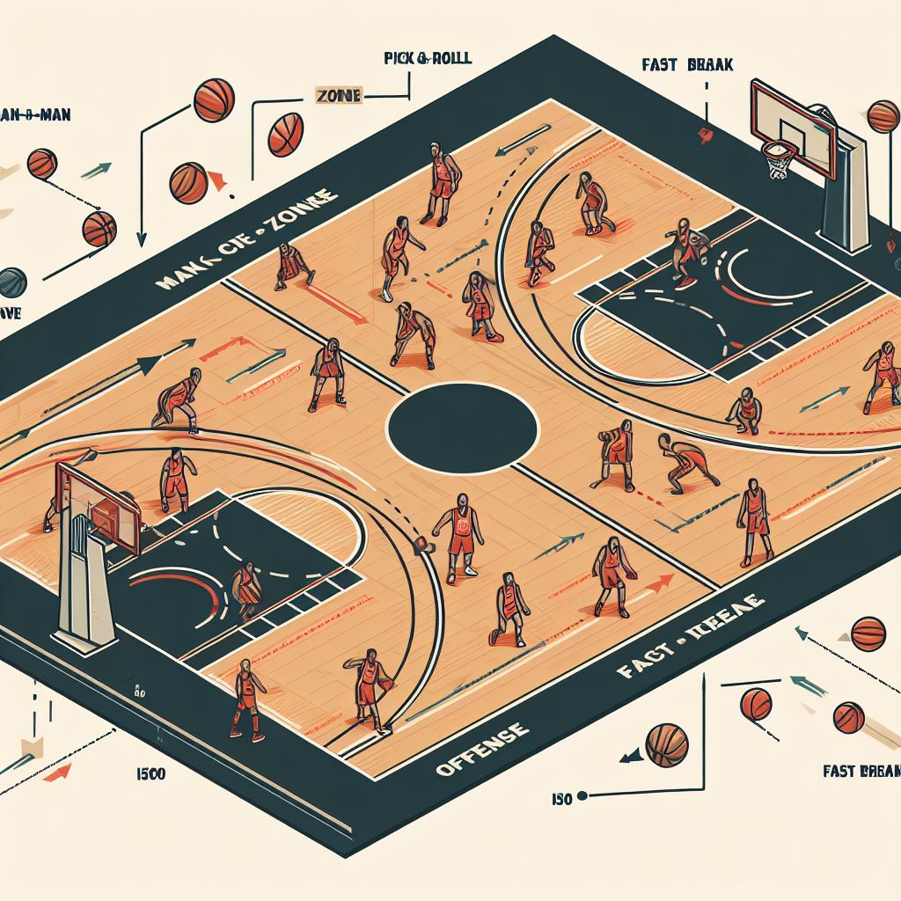
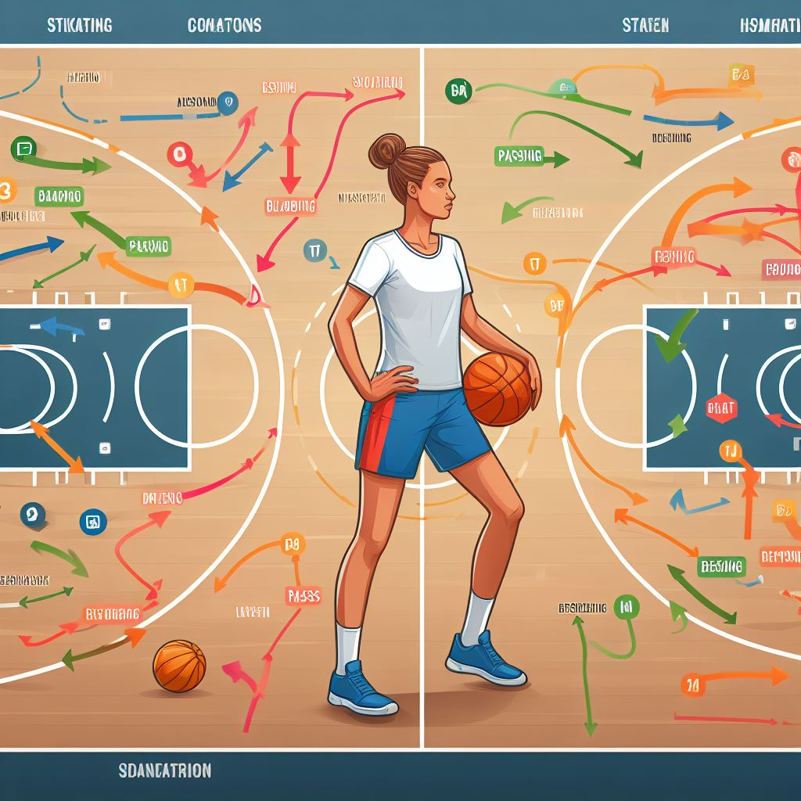
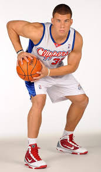
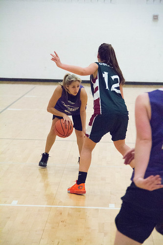
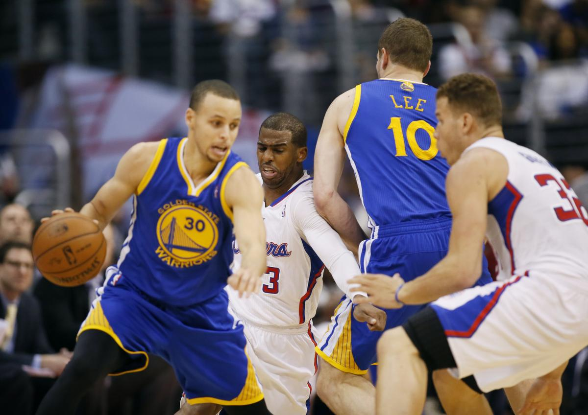
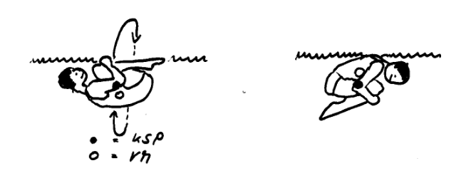

<!--
author: Jan Müller

titel: Sport BG E12.1 Schuljahr 23/24

email:  SmFuLk11ZWxsZXI0QHNjaHVsZS5oZXNzZW4uZGU= (base64;-)

version:  0.1.0

language: Deutsch

narrator: Deutsch Female

comment:  Bei der Erstellung dieser Arbeitsmaterialien wurde Bing-Chat verwendet. Als Initial-Prompts wurden meist die im Text befindlichen Überschriften in Frageform verwendet. 

link:     https://cdn.jsdelivr.net/chartist.js/latest/chartist.min.css

script:   https://cdn.jsdelivr.net/chartist.js/latest/chartist.min.js

import: https://raw.githubusercontent.com/liaScript/mermaid_template/master/README.md

-->

# Sport BG E12.1 Schuljahr 23/24 1. Halbjahr

## Basketball - Taktik


Die Taktik spielt im modernen Basketball eine wichtige Rolle. Sie kann über Sieg und Niederlage entschieden. 

Die Taktik gliedert sich in folgende drei aufeinander aufbauenden Bereiche[^1]:

1. Individualtaktik in Angriff und Verteidigung
2. Gruppentaktik in Angriff und Verteidigung
3. Mannschaftstaktiken in Angriff und Verteidigung

[^1]: Das Spiel mit dem Roten Ball - Adolph&Becker - Kapitel 5

### Individualtaktiken im Basketball



Individualtaktiken im Basketball sind die gezielten Maßnahmen, die ein Spieler anwendet, um einen Vorteil oder einen Nachteil gegenüber seinem Gegner zu erlangen. Es gibt verschiedene Arten von Individualtaktiken, die je nach Situation und Position des Spielers angewendet werden können. 
In diesem Artikel werden einige Beispiele für Individualtaktiken im Angriff und in der Verteidigung vorgestellt.

#### Individualtaktiken im Angriff


Individualtaktiken im Basketball im Angriff sind die gezielten Maßnahmen, die ein Spieler anwendet, um einen Vorteil gegenüber seinem Gegner zu erlangen und einen erfolgreichen Abschluss zu erzielen. 

Es gibt verschiedene Arten von Individualtaktiken, die je nach Situation und Position des Spielers angewendet werden können. Einige Beispiele sind:

- **Schrittfinten:** Das sind Täuschungsschritte, die der Angreifer ausführt, um den Verteidiger zu verwirren und an ihm vorbeizuziehen. Es gibt verschiedene Arten von Schrittfinten, wie z.B. Jab Step, Jab & Go, Cross-Over-Step, Rocker Step und Rocker & Go[^1].
- **Dribbelfinten:** Das sind Handwechsel oder Geschwindigkeitsänderungen, die der Angreifer während des Dribbelns macht, um den Verteidiger auszuspielen oder abzuschütteln. Es gibt verschiedene Arten von Dribbelfinten, wie z.B. Hesitation, Crossover, Behind-the-Back, Between-the-Legs und Spin Move[^1].
- **Lauffinten:** Diese werden vom Angreifer ohne Ball ausgeführt. Sie dienen vor allem dazu sich vom direkten Gegenspieler abzusetzen und in Ballbesitz zu kommen[^1]. Beispiele sind der I-Cut, V-Cut und L-Cut.
- **Passfinten:** Unter Passfinden versteht man das Antäuschen eines Passes in einen bestimmte Richtung und das Spielen des Pases in einen andere Richtung. Ein sehr bekanntes Beispiel ist der no-look-pass[^2].
- **Wurffinten:** Eine Wurffinte wird angewendet, um den Verteidiger aus seiner stabilen Position herauszubringen. Z.b. durch einen Blick zum Korb und das Über-den-Kopf-nehmen des Balles wird eine Korpwurf fintiert. Reagiert der Verteidiger daruf wird er sich strecken oder sogar springen, sodass der Verteidiger evtl. an ihm Vorbeidribbeln kann[^2].

[^1]: 1-1 Angreiferschulung - 3 - Basketball Co\@ches Corner https://www.bbcoach.de/wp/1-1-angreiferschulung-3/.
[^2]: Das Spiel mit dem Roten Ball - Adolph&Becker - Kapitel 5.1.1.3

---
**Weitere Quellen**

- [Individuelles Angriffspiel - DHB Trainer Center.](https://www.dhb-trainercenter.de/dhb-rahmentrainingskonzeption/grundlagentraining/individuelles-angriffspiel/?L=0.)
- [Basketball-Taktik: Gezielte Strategien zu Angriff & Verteidigung.](https://www.owayo.de/magazin/basketballtaktik-gezielte-strategien-angriff-und-verteidigung-basketball-de.htm.)
- [Der Angriff im Basketball - VIBSS.](https://vibss.de/fileadmin/Medienablage/Sportpraxis/PH_Basketball/PH_Basketball_-_Angriff.pdf.)

#### Individuelle Grundstellung im Angriff


Die Basketballgrundstellung Tuck-Stellung, das Facing und die SPD-Position sind wichtige Elemente der Individualtaktik im Angriff. Sie ermöglichen es dem Spieler, flexibel und schnell auf die Spielsituation zu reagieren und eine der drei Optionen Schießen, Passen oder Dribbeln auszuführen. Die Begriffe bedeuten:

- **Tuck-Stellung**: Die Tuck-Stellung ist eine Körperhaltung, bei der der Spieler den Ball mit beiden Händen fest umfasst und ihn etwas seitlich am Körper auf Hüfthöhe hält. Damit schützt er den Ball vor dem Verteidiger und ist bereit, ihn zu passen oder zu dribbeln[^1].
- **Facing**: Das Facing ist die Ausrichtung des Spielers zum Korb. Der Spieler sollte immer mit dem Gesicht zum Korb stehen, um die Wurfmöglichkeiten zu erkennen und den Blickkontakt mit den Mitspielern zu halten[^2].
- **SPD-Position**: Die SPD-Position (Schießen, Passen, Dribbeln) ist die Grundstellung eines Spielers in Ballbesitz. Sie wird auch als Triple-Threat-Position oder Dreifach-Bedrohung bezeichnet, da der Spieler drei Optionen hat, die er ausführen kann. Die SPD-Position ist durch die folgende Körperhaltung gekennzeichnet[^3]:
  
  - parallele Fußstellung
  - Gewicht auf den Fußballen
  - Gleichgewicht
  - gebeugte Knie
  - aufrechter Oberkörper
  - Kopf hoch, Blick zum Korb
  - Ball mit beiden Händen fest umpackt
  - Geschütze Ballhaltung auf Hüfthöhe


Die SPD-Position ist die Basketballgrundstellung, die aus dem Ein-Kontakt-Stopp oder dem Tuck-Stopp erreicht werden kann. Sie ermöglicht es dem Spieler, explosiv anzutreten, einen Schuss zu nehmen oder einen Pass zu spielen[^3].

[^1]: Einführung der SPD-Position – Basketball Co\@ches Corner. https://www.bbcoach.de/wp/einfuhrung-der-spd-position/.
[^2]: Fangen und Passen, Spielformen – Basketball Co\@ches Corner. https://www.bbcoach.de/wp/fangen-und-passen-spielformen/.
[^3]: SPD-Stellung – Wikipedia. https://de.wikipedia.org/wiki/SPD-Stellung.

### Individualtaktiken in der Verteidigung


Individualtaktiken im Basketball in der Verteidigung sind die gezielten Maßnahmen, die ein Spieler anwendet, um einen Nachteil gegenüber seinem Gegner zu vermeiden und einen erfolgreichen Ballgewinn zu erzielen. 

Es gibt verschiedene Arten von Individualtaktiken, die je nach Situation und Position des Spielers angewendet werden können. Einige Beispiele sind:

- **Beinarbeit:** Das ist die Fähigkeit, sich schnell und geschickt mit den Füßen zu bewegen, um den Angreifer zu verfolgen, abzudrängen oder zu blocken. Es gibt verschiedene Arten von Beinarbeit, wie z.B. Push Step, Swing Step, Release Step und Slide Step[^1].
- **Armarbeit:** Das ist die Fähigkeit, die Arme aktiv und gezielt einzusetzen, um den Angreifer zu stören, zu behindern oder den Ball abzunehmen. Es gibt verschiedene Arten von Armarbeit, wie z.B. Hand in the Face, Hand Check, Hand Denial und Hand Steal[^1].
- **Körperhaltung:** Das ist die Fähigkeit, eine optimale Position und Balance zu halten, um den Angreifer zu kontrollieren und zu reagieren. Eine gute Körperhaltung beinhaltet eine leichte Vorlage des Oberkörpers, eine tiefe Hüftstellung, eine breite Beinstellung und einen Blick auf den Ball[^1].
- **Antizipation:** Das ist die Fähigkeit, die Absichten und Bewegungen des Angreifers vorherzusehen und entsprechend zu handeln. Eine gute Antizipation erfordert eine hohe Konzentration, eine gute Beobachtung und eine schnelle Entscheidung[^2].

[^1]: Basketball-Taktik: Gezielte Strategien zu Angriff & Verteidigung. https://www.owayo.de/magazin/basketballtaktik-gezielte-strategien-angriff-und-verteidigung-basketball-de.htm.
[^2]: Basketball in der Schule: Die Verteidigung » mobilesport.ch. https://www.mobilesport.ch/basketball/basketball-in-der-schule-die-verteidigung/.

---
**Weitere Quellen**

- [1-1 Angreiferschulung – 3 – Basketball Co\@ches Corner.](https://www.bbcoach.de/wp/1-1-angreiferschulung-3/.)
- [Basketballtraining.de » Die Individual-Verteidigung als Grundlage jeder ....](http://basketballtraining.de/die-individual-verteidigung-als-grundlage-jeder-verteidigungsstrategie/.)
- [Basketballtraining.de » Individual- und Gruppentaktik im Basketball ....](http://basketballtraining.de/78/.)

#### Individuelle Grundstellung in der Verteidigung


Die Körperstellung in der Verteidigung im Basketball ist eine wichtige Grundlage, um den Angriff des Gegners zu stoppen oder den Ball zu erobern. Dabei geht es darum, die eigene Balance, Beweglichkeit und Reaktionsfähigkeit zu optimieren und den Gegner unter Druck zu setzen. 

Eine gute Körperstellung in der Verteidigung im Basketball ist durch die folgenden Merkmale gekennzeichnet[^1][^2]:

- Die Füße stehen parallel und schulterbreit auseinander. Damit hat der Spieler eine stabile Basis und kann schnell in alle Richtungen laufen oder springen.
- Die Knie sind leicht gebeugt und das Gewicht ist auf den Fußballen verteilt. Damit kann der Spieler explosiv starten, stoppen oder wechseln und seine Geschwindigkeit anpassen.
- Der Oberkörper ist aufrecht und der Kopf ist hoch. Damit hat der Spieler eine gute Sicht auf den Ball, den Gegenspieler und das Spielfeld und kann die Situation lesen und antizipieren.
- Die Arme sind seitlich vorne mit leicht gebeugten Ellbogen angehoben und die Handflächen zeigen nach oben. Damit kann der Spieler den Gegenspieler stören, Pässe abfangen oder Würfe blockieren.
- Die Verteidigungsposition sollte immer so sein, dass der Spieler sich zwischen dem Gegenspieler und dem Korb befindet. Damit kann er den Zugang zum Korb erschweren und den Winkel für einen Wurf verkleinern.
  
Die Körperstellung in der Verteidigung im Basketball sollte immer an die Spielsituation angepasst werden. Zum Beispiel sollte der Spieler seinen Abstand zum Gegenspieler je nach dessen Stärken und Schwächen variieren. Wenn der Gegenspieler ein guter Distanzschütze ist, sollte der Spieler näher an ihm dran sein, um den Wurf zu erschweren. Wenn der Gegenspieler ein guter Penetrator ist, sollte der Spieler etwas mehr Abstand halten, um den Zug zum Korb zu verhindern[^2].

[^1]: Die Verteidigung im Basketball - VIBSS. https://vibss.de/fileadmin/Medienablage/Sportpraxis/PH_Basketball/PH_Basketball_-_Verteidigung.pdf.
[^2]: Unterrichtseinheit 14: Verteidigung MMV (Mann-Mann-Verteidigung) - DBB. https://www.basketball-bund.de/wp-content/uploads/UE-14-Verteidigung-MMV-Mann-Mann-Verteidigung.pdf.

### Gruppentaktik im Angriff


Gruppentaktiken im Angriff beim Basketball sind die gezielten Strategien, die eine kleine Gruppe von Spielern anwendet, um sich einen Vorteil gegenüber der gegnerischen Verteidigung zu verschaffen. Dabei geht es darum, die eigenen technischen und körperlichen Fähigkeiten optimal zu nutzen und die Schwächen der Gegner auszunutzen. 

Einige mögliche Gruppentaktiken im Angriff beim Basketball sind:

- **Pick and Roll**: Ein Pick and Roll ist eine Gruppentaktik, die durch zwei Spieler ausgeführt wird. Dabei stellt ein Spieler (der Picker) seinem Mitspieler (dem Ballführer) einen Block, um ihn vom Verteidiger freizubekommen. Anschließend löst sich der Picker vom Block und läuft zum Korb (Roll). Der Ballführer kann dann entweder selbst werfen oder den Picker anspielen¹. Der Pick and Roll erfordert eine gute Abstimmung zwischen den beiden Spielern und eine schnelle Entscheidung des Ballführers[^1].
- **Give and Go**: Ein Give and Go ist eine weitere Gruppentaktik, die durch zwei Spieler ausgeführt wird. Dabei passt ein Spieler den Ball zu einem Mitspieler und läuft sich dann selbst frei (Give). Der Mitspieler passt den Ball zurück zum ursprünglichen Ballführer, der nun in einer guten Wurfposition ist (Go). Das Give and Go setzt voraus, dass der Spieler sich vom Gegner lösen und sich anbieten kann[^2].

[^1]: Basketball-Taktik: Gezielte Strategien zu Angriff & Verteidigung. https://www.owayo.de/magazin/basketballtaktik-gezielte-strategien-angriff-und-verteidigung-basketball-de.htm.
[^2]: Der Angriff im Basketball - VIBSS. https://vibss.de/fileadmin/Medienablage/Sportpraxis/PH_Basketball/PH_Basketball_-_Angriff.pdf.

---
**Weitere Quellen**

- [Gruppentaktik – eine zentrale Taktik im Basketball.](ttps://basketballtraining.de/gruppentaktik-eine-zentrale-taktik-im-basketball/.)

### Gruppentaktik in der Verteidigung


Gruppentaktiken in der Verteidigung im Basketball sind die gezielten Strategien, die eine kleine Gruppe von Spielern anwendet, um den Angriff des Gegners zu stoppen oder den Ball zu erobern. Dabei geht es darum, die eigenen technischen und körperlichen Fähigkeiten optimal zu nutzen und die Stärken des Gegners zu neutralisieren. 

Einige mögliche Gruppentaktiken in der Verteidigung im Basketball sind:

- **Zonenverteidigung**: Eine Zonenverteidigung ist eine Gruppentaktik, bei der die Spieler nicht einen bestimmten Gegenspieler, sondern einen bestimmten Raum auf dem Spielfeld verteidigen. Dabei teilen sich die Spieler das Spielfeld in verschiedene Zonen auf, die sie je nach Position und Situation übernehmen. Ziel einer Zonenverteidigung ist es, den Zugang zum Korb zu erschweren, Pässe abzufangen oder Würfe zu blockieren[^1].
- **Mann-gegen-Mann-Verteidigung**: Eine Mann-gegen-Mann-Verteidigung ist eine Gruppentaktik, bei der jeder Spieler einen bestimmten Gegenspieler direkt verteidigt. Dabei versucht der Verteidiger, den Angreifer am Ballbesitz, am Dribbling, am Passen oder am Werfen zu hindern. Ziel einer Mann-gegen-Mann-Verteidigung ist es, den Gegner unter Druck zu setzen, Fehler zu provozieren oder den Ball zu erobern[^1].
- **Mischformen**: Neben den reinen Varianten der Zonenverteidigung und der Mann-gegen-Mann-Verteidigung gibt es auch Mischformen, bei denen die Mehrheit der verteidigenden Spieler den Raum und einer oder zwei Spieler einen direkten Gegenspieler verteidigen. Die bekanntesten Mischformen sind die Box-and-One-, die Triangle-and-Two- und die Diamond-and-One-Verteidigung. Ziel einer Mischform ist es, die gefährlichsten Angreifer des Gegners auszuschalten oder die gegnerische Angriffsstrategie zu stören[^2].

[^1]: Gruppentaktik – eine zentrale Taktik im Basketball. https://basketballtraining.de/gruppentaktik-eine-zentrale-taktik-im-basketball/.
[^2]: Basketball-Taktik: Gezielte Strategien zu Angriff & Verteidigung. https://www.owayo.de/magazin/basketballtaktik-gezielte-strategien-angriff-und-verteidigung-basketball-de.htm.

---
**Weiterer Quellen**

- [Basketball: Mischformen aus Zonenverteidigung und Mann-gegen-Mann ....](https://www.trainingsworld.com/training/taktiktraining/basketball-taktik-mischformen-zonenverteidigung-mann-gegen-mann-verteidigung-2503373.)
- [Basketball in der Schule: Die Verteidigung » mobilesport.ch.](https://www.mobilesport.ch/basketball/basketball-in-der-schule-die-verteidigung/.)
- [Basketball Übungen für verteidigen Verwendung in Ihrem Training?.](https://www.yoursportplanner.com/de/ubungen/basketball-de/verteidigen/.)

### Lernkarten


**Hier geht es zu den [Lernkarten](https://app.mochi.cards/decks/67233147-73f4-462a-984f-207550c6f793/HRqVAMT4/Basketball-Taktik)**.


Zum Lernen der Karten wählen Sie auf der Webseite oben rechts unter New cards den Menüpunkt `Cram` aus.


Um eine Karteikarte umzublättern klicken Sie diese einfach an.

Mit Hilfe der Rückseite überprüfen Sie, ob Sie die Antwort gewusst oder nicht gewusst haben.

- Mit der `Space` Taste zeigen Sie an, dass Sie die Antwort wussten.
- Mit der `R` Taste zeigen Sie an, dass Sie diese noch nicht wussten.

### Kompetenzcheck

**1. Ordnen Sie die folgenden Beschreibung der jeweils passenden Fintenart zu!**

<!-- 
    data-randomize 
    data-solution-button="off"
    data-max-trials="3" 
-->
| Fintenart | Beschreibung                  |
| ------------- | ------------------------ |
| [[ Lauffinten | Wurffinten | Passfinten | Dribblefinten | (Schrittfinten) ]] | Das sind Täuschungsschritte, die der Angreifer ausführt, um den Verteidiger zu verwirren und an ihm vorbeizuziehen. |
| [[ Lauffinten | Wurffinten | Passfinten | (Dribblefinten) | Schrittfinten ]] |  Das sind Handwechsel oder Geschwindigkeitsänderungen, die der Angreifer während des Dribbelns macht, um den Verteidiger auszuspielen oder abzuschütteln. |
| [[ (Lauffinten) | Wurffinten | Passfinten | Dribblefinten | Schrittfinten ]] | Diese werden vom Angreifer ohne Ball ausgeführt. Sie dienen vor allem dazu sich vom direkten Gegenspieler abzusetzen und in Ballbesitz zu kommen |
| [[ Lauffinten | Wurffinten | (Passfinten) | Dribblefinten | Schrittfinten ]] | Unter diesen Finten versteht man das Antäuschen eines Passes in einen bestimmte Richtung und das Spielen des Pases in einen andere Richtung. |
| [[ Lauffinten |(Wurffinten) | Passfinten | Dribblefinten | Schrittfinten ]] | Diese Finte wird angewendet, um den Verteidiger aus seiner stabilen Position herauszubringen. Z.b. durch einen Blick zum Korb und das Über-den-Kopf-nehmen des Balles wird eine Korpwurf fintiert. |

**2. Ordnen Sie die folgenden Beschreibung der jeweils passenden Angriffs-Grundstellungen zu!**

<!-- 
    data-randomize 
    data-solution-button="off"
    data-max-trials="3" 
-->
| Grundstellung | Beschreibung             |
| ------------- | ------------------------ |
| [[ SPD-Position | Tuck-Stellung | (Facing) ]] | Dies ist die Ausrichtung des Spielers zum Korb. Der Spieler sollte immer mit dem Gesicht zum Korb stehen, um die Wurfmöglichkeiten zu erkennen und den Blickkontakt mit den Mitspielern zu halten. |
| [[ SPD-Position | (Tuck-Stellung) | Facing ]] | Diese Stellung ist eine Körperhaltung, bei der der Spieler den Ball mit beiden Händen fest umfasst und ihn etwas seitlich am Körper auf Hüfthöhe hält. Damit schützt er den Ball vor dem Verteidiger und ist bereit, ihn zu passen oder zu dribbeln.  |
| [[ (SPD-Position) | Tuck-Stellung | Facing ]] |  Dies ist die Grundstellung eines Spielers in Ballbesitz. Sie wird auch als Triple-Threat-Position oder Dreifach-Bedrohung bezeichnet. |

**3. Welche Punkte sind in der indivduellen Verteidigung wichtig?**

<!-- 
    data-randomize 
    data-solution-button="off"
    data-max-trials="3" 
-->

[[x]] Beinarbeit
[[x]] Armearbeit
[[x]] Körperhaltung
[[x]] Antizipation 
[[ ]] Ballhandling
[[ ]] Wurfqoute 

**4. Ordnen Sie die folgenden Beschreibung der jeweils passenden Gruppentaktik zu!**

<!-- 
    data-randomize 
    data-solution-button="off"
    data-max-trials="3" 
-->
| Gruppentakitk | Beschreibung             |
| ------------- | ------------------------ |
| [[ Pick and Roll | (Give and Go) | Mann-Mann-Verteidigung | Zonen-Verteidigung ]] | Dies ist eine Gruppentaktik, die durch zwei Spieler ausgeführt wird. Dabei passt ein Spieler den Ball zu einem Mitspieler und läuft sich dann selbst frei. Der Mitspieler passt den Ball zurück zum ursprünglichen Ballführer, der nun in einer guten Wurfposition ist. |
| [[ Pick and Roll | Give and Go | Mann-Mann-Verteidigung | (Zonen-Verteidigung) ]] |  Dies ist eine Gruppentaktik, bei der die Spieler nicht einen bestimmten Gegenspieler, sondern einen bestimmten Raum auf dem Spielfeld verteidigen. Dabei teilen sich die Spieler das Spielfeld in verschiedene Zonen auf, die sie je nach Position und Situation übernehmen. Ziel ist es, den Zugang zum Korb zu erschweren, Pässe abzufangen oder Würfe zu blockieren.|
| [[(Pick and Roll) | Give and Go | Mann-Mann-Verteidigung | Zonen-Verteidigung ]] |Dies ist eine Gruppentaktik, die durch zwei Spieler ausgeführt wird. Dabei stellt ein Spieler seinem Mitspieler (dem Ballführer) einen Block, um ihn vom Verteidiger freizubekommen. Anschließend löst sich der Blocksteller vom Block und läuft zum Korb. Der Ballführer kann dann entweder selbst werfen oder den Blocksteller anspielen. |
| [[ Pick and Roll | Give and Go | (Mann-Mann-Verteidigung) | Zonen-Verteidigung ]] | Dies ist eine Gruppentaktik, bei der jeder Spieler einen bestimmten Gegenspieler direkt verteidigt. Dabei versucht der Verteidiger, den Angreifer am Ballbesitz, am Dribbling, am Passen oder am Werfen zu hindern. Ziel ist es, den Gegner unter Druck zu setzen, Fehler zu provozieren oder den Ball zu erobern. |


# Sport BG E12.1 Schuljahr 23/24 2. Halbjahr

```@mermaid
gantt
    dateFormat YYYY-MM-DD
    section Fitness (E.3)
        KW5     :2024-01-29, 1d
        KW6     :2024-02-05, 1d

    section Badminton
        KW8     :2024-02-19, 1d
        KW9     :2024-02-26, 1d
        KW10    :2024-03-04, 1d
        KW11    :2024-03-11, 1d
        KW12    :2024-03-18, 1d

    section Schwimmen (E.1)
        KW16    :2024-04-15, 1d
        KW17    :2024-04-22, 1d
        KW18    :2024-04-29, 1d
        KW19    :2024-05-06, 1d
        KW20    :2024-05-13, 1d
        KW22    :2024-05-27, 1d
    
    section ?? E.??
        KW23    :2024-06-03, 1d
        KW24    :2024-06-10, 1d
        KW25    :2024-06-17, 1d
        KW26    :2024-06-24, 1d
        KW27    :2024-07-01, 1d
        KW28    :2024-07-08, 1d
  
```
## Badminton

```@mermaid
timeline
          Teilkompetenz Schlagen und Laufen im Vorderfeld 
          : W1 Griffarten, Schläge am Netz, Aufschlag, Ausfallschritt
          : S1 Netzdrop, Ausfallschritt und Laufwege
          : S2 Kurzer Rückhandaufschlag
          : S3 Rückhand- und Vorhand-Lift
          : Die Lernenden können im Spiel Laufwege und Schläge im Vorderfeld anwenden. 

          Teilkompetenz Schlagen und Laufen im Mittelfeld 
          : W2 Breitschaftsstellung, Drives
          : S4 Dvives im Mittelfeld
          : S5 Ballwechsel spielen im Mittelfeld
          : Die Lernenden können im Spiel Laufwege und Schläge im Mittelfeld anwenden.

          Kompetenz Spielfähigkeit im Vor- und Mittelfeld
          : Die Lernenden können im Spiel Laufwege und Schlagformen im Vor- und Mittelfeld anwenden.

```
### S1 Netzdrop Ausfallschritte und Laufweg

#### 1. Stundenbeginn

- Ablauf
  - Lehrperson erklärt und zeigt:
     - Ausfallschritt – großer Schritt vorwärts mit dem „Schlägerfuß“.
     - Rückhand- und Vorhand-Netzdrop.
     - Rückhand- und Vorhand-Netzdrop mit Ausfallschritt.
- Wichtige Übungshinweise 
  - Oberkörper aufrecht halten mit  ausgestrecktem “Schlägerarm”
  - Knie anheben, bevor man den Fuß nach vorne „kickt”.
  - Die Ferse berührt als erster Teil des Fußes den Boden.
  - Lockere Griffhaltung beim Schlag besonders herausstellen
---
#### 2. Balance und werfen

- Ablauf
  - Schüler gehen paarweise zusammen und stehen sich auf einem Bein gegenüber. Sie werfen und fangen gegenseitig einen Federball und versuchen, ihr Gleichgewicht nicht zu verlieren
- Wichtige Übungshinweise
  - Übung auch auf dem Anderen Bein durchführen
  - Den Ball nach links oder rechts werfen
---
#### 3. Federbälle auf dem Kopf balancieren

- Ablauf
  - Die Schüler balancieren einen umgedrehten Federball auf ihrem Kopf und gehen mit großen Ausfallschritten voran (auf Übungshinweise achten!). Die Schritte können nur mit dem Schlägerbein oder abwechselnd ausgeführt werden 
- Wichtige Übungshinweise
  - Knie anheben, bevor man den Fuß nach vorne „kickt”.
  - Die Ferse berührt als erster Teil des Fußes den Boden.
  - Oberkörper aufrecht halten.
  
---

#### 4. Netzdrop Rückhand und Vorhand und Ausfallschritt

- Ablauf
  - Die Schüler gehen paarweise zusammen. Ein Kind wirft einen Federball nach oben und über das Netz. Der Partner übt den Rückhand-Netzdrop.
  - Als Steigerung wird die Schlagbewegung gleichzeitig mit dem Ausfallschritt ausgeführt.
  - Bei der Schlagbewegung wird der Ball nur leicht über das Netz „geschoben“.
  - Übung auf der Vorhandseite wiederholen.
- Wichtige Übungsanweisung
  - Rollen jeweils nach 12 Federbällen tauschen.
  - Schläger vor dem Körper halten.
  - Ball möglichst oben an der Netzkante schlagen.
  - Immer wieder Griffhaltung kontrollieren.
---
#### 5. Ballwechsel am Netz spielen

- Ablauf
  - Zwei Schüler üben Netzdrops, indem sie Ballwechsel im Vorderfeld spielen.
  - Sie spielen ausschließlich Netzdrops unterhalb der Netzkante.
  - Die Ballwechsel beginnen, indem der Ball „eingeworfen” wird.
- Wichtige Übungshinweise
  - Lockere Griffhaltung.
  - Immer wieder richtige Griffhaltung kontrollieren.
---
### S2 Kurzer Rückhandaufschlag

---

### S3 Rückhand- und Vorhandlift

**Wohin fliegt der Ball?**
Lifts fliegen vom Netz weg ins Hinterfeld. Offensive Lifts sind gefährlich für den Gegner, wenn sie knapp über seine Reichhöhe fliegen. Defensive Lifts fliegen deutlich höher über die gegnerische Reichhöhe und den gegnerischen Schläger.

**Wann brauchen wir den Schlag?**
Wenn wir im Vorderfeld sind und den Ball knapp unterhalb der Netzkante schlagen können, haben wir Gelegenheit zu einem offensiven Lift und stellen eine neutrale Situation her.
Wenn wir im Vorderfeld sind und den Ball deutlich unterhalb der Netzkante schlagen müssen, kann man nur noch einen defensiven Lift spielen, der dann auch eine defensive Situation herstellt.

**Warum brauchen wir den Schlag?**
Offensive Lifts haben das Ziel, den Ball hinter den Gegner zu schlagen, sodass für ihn nur ein schwacher Rückschlag möglich ist.
Defensive, hohe Lifts bewegen den Gegner an die Grundlinie und bringen selbst Zeit, sich wieder in eine gute Position für den nächsten Schlag zu bringen.

**Wie sieht der Rückhandlift aus?**
![[rueckhandLift.png]]

**Wie sieht der Vorhandlift aus?**
![[vorhandLift.png]]
#### 1. Stundenbegin

- **Ablauf**
	- Lehrperson erklärt die wesentlichen Inhalte dieser Stunde:
		- Einführung des Rückhand- Lift von unterhalb der Netzkante hoch in das Hinterfeld. Dieser Schlag gibt dem Spieler genügend Zeit, um in den zentralen Bereich zurückzulaufen, bevor der Gegner den Ball schlägt.
- **Hinweise**
	- Erkläre und demonstriere die Technik Rückhand Lift.
	- Unterstreiche, dass der Schlag dazu dient, hoch und weit in das Hinterfeld zu spielen.

#### 2. Rückhand Lift

- **Ablauf**
	- Einführung und Training des Rückhand- Lift: Jeder Schüler hat einen Schläger und einen Ball und schlägt den Ball mit der Rückhand fortlaufend so hoch wie möglich nach oben.
	- Im nächsten Schritt gehen die Übenden zu zweit zusammen. Ein Übender wirft zu und der andere trainiert Rückhand Lift so hoch und weit nach hinten wie möglich.
	- Nun darf der Zuwerfer im Augenblick des Schlages schnell ins Hinterfeld laufen und versuchen, den Ball zu fangen.
	- Wechsel nach 12 Schlägen.
- **Hinweise**
	- Auf die korrekte Griffhaltung achten.
	- Weder ein Netz noch Feldlinien sind notwendig. Sicherlich hilft, die Entfernung mit Gegenständen zu markieren.
	- Falls notwendig, kann man den Schwierigkeitsgrad erhöhen, indem man die Beinbewegung hinzunimmt.

#### 3. Vorhand-Lift

- **Ablauf**
	- Einführung und Training des Vorhand- Lift: Jeder Schüler hat einen Schläger und einen Ball und schlägt den Ball mit der Rückhand fortlaufend so hoch wie möglich nach oben.
	- Im nächsten Schritt gehen die Übenden zu zweit zusammen. Ein Übender wirft zu und der andere trainiert Rückhand Lift so hoch und weit nach hinten wie möglich.
	- Nun darf der Zuwerfer im Augenblick des Schlages schnell ins Hinterfeld laufen und versuchen, den Ball zu fangen.
	- Wechsel nach 12 Schlägen.
- **Hinweise**
	- Auf die korrekte Griffhaltung achten.
	- Weder ein Netz noch Feldlinien sind notwendig. Sicherlich hilft, die Entfernung mit Gegenständen zu markieren.
	- Falls notwendig, kann man den Schwierigkeitsgrad erhöhen, indem man die Beinbewegung hinzunimmt.

#### 4. Aus dem Netzspiel einen Lift Spielen

- **Ablauf**
	- Die Schüler spielen paarweise Ballwechsel im Vorderfeld.
	- Sie dürfen statt Netzdrop auch einen Lift spielen, der jedoch zwischen zwei Markierungen im Hinterfeld fallen muss.
	- Der Spieler, dem dies gelingt, erhält einen Punkt. Trifft er nicht in den Zielbereich, wird ein Punkt abgezogen. Nach jedem Lift endet der Ballwechsel.
	- Variation des Spiels – sobald der Lift gespielt wurde, darf der andere Spieler versuchen, den Ball zu fangen, um selbst einen Punkt zu erhalten.
- **Hinweise**
	- Regelmäßig Partner wechseln, damit die einzelnen Spiele nicht zu lang werden.
	- Variante: Schüler können ihre Punkte mit ins nächste Spiel nehmen, sodass immer weitergezählt wird.

---

## Schwimmen

---

## Inhaltsfeld (Themenfeld) Outdoor

### Mögliche Inhaltsfelder

**Spielen**

- Endzonen-Spiele (Flag Football, Ultimate-Frisbee)
  Im Sportpark Erbach
  
**Laufen, Springen, Werfen**

- Leichtathletik 
- Orientierungslaufen

**Fahren, Rollen, Gleiten**

- Mountainbike fahren

---

### Mögliche Themenfelder

- E.1 Grundlagen des Bewegungslernens
- E.2 Kooperation und Konkurrenz im Sportspiel 
- E.3 Grundlagen sportlichen Trainings
- E.4 Grundlagen sportlicher Leistung – Koordination
- E.5 Grundlagen sportlicher Leistung – Kondition

---

